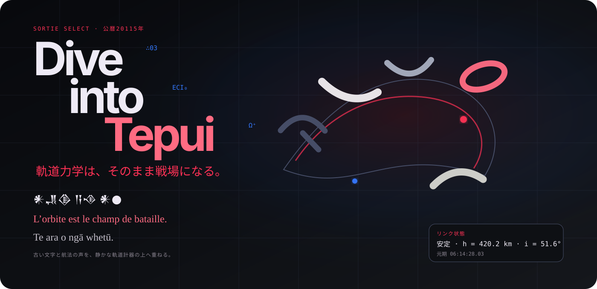
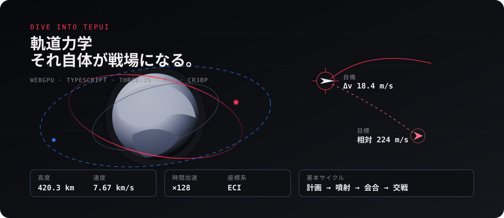
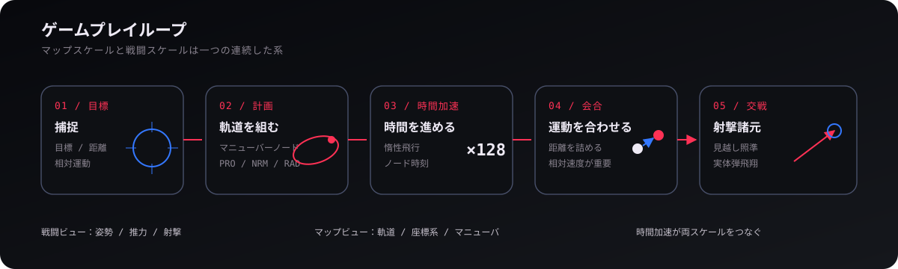
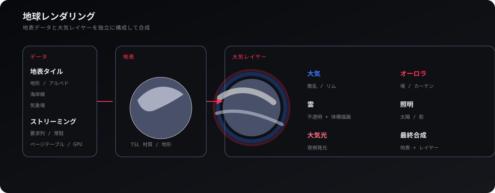
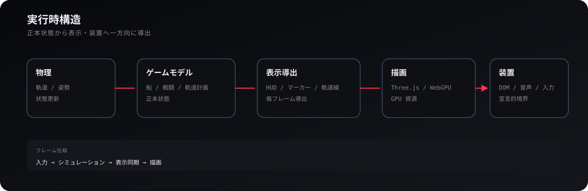

<p align="center">
  
</p>

<p align="center">
  <a href="https://mikanixonable.github.io/dive-into-tepui/"><strong>▶ ブラウザで遊ぶ</strong></a>
  ·
  <a href="WIKI.md"><strong>開発 WIKI</strong></a>
  ·
  <a href="DEVELOP/SPEC/README.md"><strong>仕様書</strong></a>
  ·
  <a href="#ゲームプレイ">ゲームプレイ</a>
  ·
  <a href="#軌道マニューバ">軌道マニューバ</a>
  ·
  <a href="#地球レンダリング">地球描画</a>
  ·
  <a href="#開発">開発</a>
</p>

<p align="center">
  <a href="https://github.com/Mikanixonable/dive-into-tepui/actions/workflows/build.yml">
    
  </a>
  
  
  
  
</p>

軌道遷移、姿勢制御、時間加速、会合、射撃を一つのゲーム状態の上で扱う、WebGPU 製の 3D 軌道力学シューティングです。詳細なコードベースの読み方は [開発 WIKI](WIKI.md)、ゲームが**どう振る舞うべきか**は [SPEC](DEVELOP/SPEC/README.md) を参照してください。

<p align="center">
  
</p>

## 概要

| 項目 | 内容 |
| --- | --- |
| **実行環境** | ブラウザ / WebGPU |
| **描画** | Three.js WebGPU 描画器 + TSL |
| **言語** | TypeScript |
| **物理** | RK4、Kepler 軌道、2次重力場、大気抵抗、太陽放射圧、剛体姿勢 |
| **航法** | マニューバーノード、ラグランジュ点、慣性系 / 回転系 |
| **保存** | ブラウザの localStorage + エクスポート |
| **公開** | GitHub Pages |

> [!TIP]
> [GitHub Pages 版](https://mikanixonable.github.io/dive-into-tepui/)を WebGPU 対応ブラウザで開き、ステージを選択してください。ゲーム中は <kbd>H</kbd> で操作説明を表示できます。

---

<a id="ゲームプレイ"></a>
## ゲームプレイ

<p align="center">
  
</p>

戦闘ビューでは姿勢・推力・照準を直接操作し、マップビューでは軌道・マニューバーノード・時間加速を扱います。**近距離戦と軌道遷移は別ゲームではなく、同じシミュレーションの異なる時間スケールです。**

### ゲームモード

| モード | 内容 |
| --- | --- |
| **stage 00** | 弾薬を回収してから始まる無限耐久サバイバル |
| **stage 0** | 周囲 5 km の敵を相手にする 120 秒スコアアタック |
| **stage 1** | 高度 420 km の地球低軌道で近傍軌道の敵 5 機を撃破 |
| **stage 2** | 通常軌道と高楕円軌道が混在する戦域 |
| **CREATIVE** | 軌道要素・ラグランジュ点などを使って物体を配置するサンドボックス |

---

<a id="軌道マニューバ"></a>
## 軌道マニューバ

<p align="center">
  
</p>

マニューバーノードは噴射後の状態と実行時刻を持ち、**PRO / RET、NRM / ANM、IN / OUT** の3軸で Δv を編集できます。L1〜L5 は二天体系の回転座標から ECI 状態へ変換され、航法やマップ表示の基準として使われます。

最適遷移を自動生成する方式ではなく、プレイヤーが予測軌道を見ながらノードを置いて軌道を組み立てます。

---

## 船体アセンブリ

<p align="center">
  
</p>

船体は **ShipAssembly** として、モジュール実体と接続辺からなるグラフで保持されます。`cockpit`、`tank`、`thruster`、`RCS`、`weapon`、`dock`、`solar_panel`、`radiator`、`booster` などが個別の状態を持ちます。

ドッキングした船体は一つの統合船体として扱われ、燃料・損傷・展開状態などもモジュール単位で保存されます。

---

## 会合と戦闘

<p align="center">
  
</p>

敵との交戦では距離だけでなく**相対速度**が重要です。ターゲット運動と弾速から見越し点を求め、実体弾を発射します。射撃は高倍率の時間加速中には行えません。

---

<a id="地球レンダリング"></a>
## 地球レンダリング

<p align="center">
  
</p>

地球は一枚の画像ではなく、**地表タイル / 地形 / 大気 / 雲 / 大気光 / オーロラ / 照明**を別系統として構成します。地表はタイル要求・常駐キャッシュ・ページテーブルを経て GPU 材質へ渡されます。

描画側には WebGPU / TSL、レイマーチング、ブルーノイズ、熱放射、複数の雲描画経路などの実装があります。

---

## 軌道力学と摂動

<p align="center">
  
</p>

軌道伝播は単純な二体問題だけではありません。点質量重力に加えて **J2 / C22 の2次重力場、多体重力、大気抵抗、太陽放射圧、日照・遮蔽**を扱います。地球では主に J2、非軸対称性を持つ天体では C22 も評価できます。

大気圏では空力荷重・加熱・燃え尽きも計算します。物理計算は `src/physics/` に分離され、Three.js に依存しません。

---

## 軌道 UI と基準座標系

<p align="center">
  
</p>

マップビューは表示原点と回転を分けて選択でき、**慣性系、公転回転系、自転系**を扱います。軌道線は各サンプル時刻で座標変換されるため、回転する基準系でも時間変化を保ったまま表示できます。

同じ画面上でラグランジュ点、予測軌道、マニューバーノード、Δv 操作を確認できます。

---

## 操作

<details>
<summary><strong>飛行・戦闘</strong></summary>

| キー | 操作 |
| --- | --- |
| <kbd>W</kbd> / <kbd>S</kbd> | 前進 / 後退 |
| <kbd>A</kbd> / <kbd>D</kbd> | 左 / 右並進 |
| <kbd>Q</kbd> / <kbd>E</kbd> | 上 / 下並進 |
| <kbd>I</kbd> / <kbd>K</kbd> | ピッチ |
| <kbd>J</kbd> / <kbd>L</kbd> | ヨー |
| <kbd>U</kbd> / <kbd>O</kbd> | ロール |
| <kbd>P</kbd> | RCS 回転制動 |
| <kbd>F</kbd> | プログレード方向へ向く |
| <kbd>C</kbd> | プログレード姿勢保持 |
| <kbd>1</kbd>〜<kbd>4</kbd> | 推力レベル |
| <kbd>T</kbd> | ターゲット選択 |
| <kbd>Z</kbd> | 照準ズーム |
| <kbd>Space</kbd> / 左クリック | 射撃 |
| <kbd>5</kbd> / <kbd>6</kbd> | ブースター分離 / 点火 |
| <kbd>7</kbd> / <kbd>8</kbd> | 太陽電池パドル |
| <kbd>9</kbd> / <kbd>0</kbd> | ラジエーター |

</details>

<details>
<summary><strong>軌道・マップ</strong></summary>

| キー | 操作 |
| --- | --- |
| <kbd>,</kbd> / <kbd>.</kbd> | 時間倍率を下げる / 上げる |
| <kbd>N</kbd> | 次のマニューバーノードまでワープ |
| <kbd>M</kbd> | 戦闘ビュー / マップビュー |
| <kbd>W</kbd> / <kbd>S</kbd> | Δv: PRO / RET |
| <kbd>A</kbd> / <kbd>D</kbd> | Δv: NRM / ANM |
| <kbd>Q</kbd> / <kbd>E</kbd> | Δv: IN / OUT |
| <kbd>X</kbd> | ノード / 軌道計画を削除 |

</details>

<details>
<summary><strong>カメラ・保存</strong></summary>

| キー / 操作 | 内容 |
| --- | --- |
| 矢印キー / ドラッグ | カメラ回転 |
| 二本指 / 中ボタンドラッグ | パン |
| ピンチ / ホイール | ズーム |
| ダブルタップ / ダブルクリック | 注視 |
| <kbd>G</kbd> | 機体姿勢へ追従 |
| <kbd>H</kbd> | 操作説明 |
| <kbd>ESC</kbd> | ポーズ / 設定 |
| <kbd>F3</kbd> | デバッグ情報 |
| <kbd>F5</kbd> | 手動セーブ |
| <kbd>F9</kbd> | セーブ管理 |

</details>

---

## 実行時構造

<p align="center">
  
</p>

物理・ゲーム状態を正本とし、HUD・軌道線・マーカーなどはそこから導出します。描画や DOM がゲーム状態の所有者にならないよう、フレーム処理は概ね **入力 → シミュレーション → 表示同期 → 描画** の順に進みます。

コードベースを詳しく読む場合は [開発 WIKI](WIKI.md) を参照してください。層・import・正本の規則は [ARCHITECTURE](DEVELOP/ARCHITECTURE.md)、コードの書き方は [CODING-RULE](DEVELOP/CODING-RULE.md) が正本です。

---

<a id="開発"></a>
## 開発

### ローカル起動

```bash
npm install
npm run dev
```

Node.js 20 以上、WebGPU 対応ブラウザを推奨します。

### 主なコマンド

| コマンド | 用途 |
| --- | --- |
| `npm run typecheck` | TypeScript 型検査 |
| `npm run test` | 全テスト |
| `npm run test:physics` | 物理テスト |
| `npm run test:game` | ゲームテスト |
| `npm run test:render` | 描画テスト |
| `npm run lint` | ESLint |
| `npm run check:boundaries` | アーキテクチャ境界検査 |
| `npm run render-lab` | 描画実験環境 |
| `npm run cloud-lab` | 雲の実験環境 |
| `npm run bgm-lab` | BGM 試聴環境 |
| `npm run ci` | 総合検証 |

より詳しい開発手順、ディレクトリ構造、テストの使い分けは [開発 WIKI](WIKI.md) にまとめています。

---

## 科学データとクレジット

| データ | 出典 / 用途 |
| --- | --- |
| **惑星テクスチャ** | Solar System Scope — CC BY 4.0 |
| **惑星全球モザイク** | USGS Astrogeology Science Center |
| **地球表面 / 地形 / 気象** | NASA Earth Observatory、NOAA NCEI ETOPO、ERA5 |
| **海岸線** | Natural Earth |
| **タンパク質構造** | RCSB Protein Data Bank |

---

## 制約

- WebGPU 非対応ブラウザでは起動できません。
- 地球表面の高精細データは実行時に読み込みます。
- セーブデータはブラウザの localStorage に保存されます。

<p align="center">
  <a href="https://mikanixonable.github.io/dive-into-tepui/"><strong>▶ Dive into Tepui を起動</strong></a>
  ·
  <a href="WIKI.md"><strong>開発 WIKI を読む</strong></a>
  ·
  <a href="DEVELOP/SPEC/README.md"><strong>SPEC を読む</strong></a>
</p>
