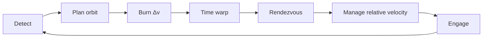
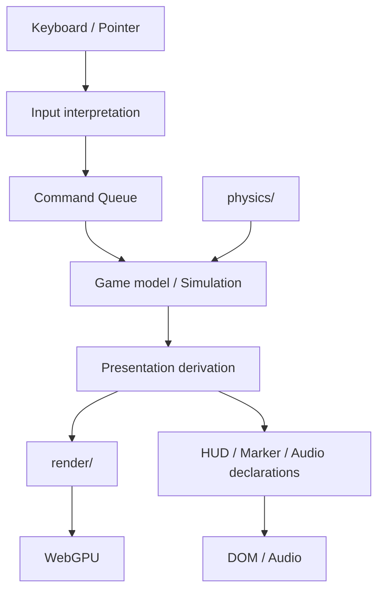
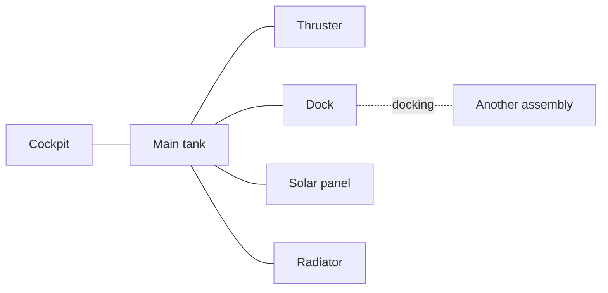

# Dive into Tepui

<p align="center">
  <strong>Orbital mechanics is the battlefield.</strong><br>
  WebGPU で動く、軌道遷移・姿勢制御・迎撃を中心にした 3D 軌道力学シューティングゲーム。
</p>

<p align="center">
  <a href="https://mikanixonable.github.io/dive-into-tepui/"><strong>▶ Play in Browser</strong></a>
  ·
  <a href="#gameplay">Gameplay</a>
  ·
  <a href="#physics--simulation">Physics</a>
  ·
  <a href="#architecture">Architecture</a>
  ·
  <a href="#development">Development</a>
</p>

<p align="center">
  <a href="https://github.com/Mikanixonable/dive-into-tepui/actions/workflows/build.yml">
    
  </a>
  
  
  
</p>

---

## Why Dive into Tepui?

<table>
<tr>
<td width="50%" valign="top">

### 🛰 Real orbital combat

敵の現在位置へ直進するのではなく、**速度ベクトルを変えて未来の軌道を交差させる**ことが戦闘になります。時間加速、相対速度、会合、離脱まで含めて軌道そのものがゲームプレイです。

</td>
<td width="50%" valign="top">

### 🎯 6-DoF spacecraft control

機体座標系の並進と RCS による姿勢制御を分離。主推進、姿勢保持、ブースター、太陽電池、ラジエーターなどを状況に応じて扱います。

</td>
</tr>
<tr>
<td width="50%" valign="top">

### 🌍 Scientific Earth rendering

地球表面・地形・大気・雲・海岸線・オーロラを別系統として扱い、NASA / NOAA / ERA5 などのデータを描画パイプラインへ取り込みます。

</td>
<td width="50%" valign="top">

### 🧩 Composable spacecraft

船体は単一モデルではなく、cockpit / tank / thruster / dock などの **module instance と connection edge からなる接続グラフ**として扱う方向で設計されています。

</td>
</tr>
</table>

---

<a id="gameplay"></a>
## Gameplay

### 基本ループ



1. <kbd>T</kbd> で敵機をターゲットに選択
2. 機首・推力方向を調整し、敵の将来軌道へ接近
3. <kbd>,</kbd> / <kbd>.</kbd> で時間加速し、会合までの長距離移動を短縮
4. 必要なら <kbd>M</kbd> でマップビューを開き、マニューバーノードを編集
5. 相対速度を管理し、射撃可能な時間倍率へ戻す
6. 照準を合わせて <kbd>Space</kbd> または左クリックで射撃

### Game modes

| Mode | Description |
| --- | --- |
| **stage 00** | 弾薬を回収してから始まる、敵の波状攻撃から生き残る無限耐久サバイバル |
| **stage 0** | 周囲 5 km 以内の色分けされた敵集団を相手にする、120 秒の撃墜数スコアアタック |
| **stage 1** | 高度 420 km の地球低軌道戦域。近傍軌道の敵 5 機を撃破 |
| **stage 2** | 通常軌道とモルニヤ級高楕円軌道が混在する戦域。マップ上の軌道遷移計画が重要 |
| **CREATIVE** | 艦艇、敵、弾薬、燃料、基地などを軌道要素やラグランジュ点から自由に配置する実験モード |

### HUD / Map view

戦闘ビューでは `SHIP STATUS`、`ORBIT`、`TARGET`、`CONTACTS` と、機首・進行方向・ターゲット・リード照準のマーカーを表示します。マップビューでは天体、実軌道、予測軌道、マニューバーノードを俯瞰し、PRO / RET、NRM / ANM、IN / OUT の各方向へ Δv を編集できます。

<details>
<summary><strong>Controls — 機体・戦闘</strong></summary>

| Key | Action |
| --- | --- |
| <kbd>W</kbd> / <kbd>S</kbd> | 機体座標系の前進 / 後退 |
| <kbd>A</kbd> / <kbd>D</kbd> | 機体座標系の左 / 右 |
| <kbd>Q</kbd> / <kbd>E</kbd> | 機体座標系の上 / 下 |
| <kbd>I</kbd> / <kbd>K</kbd> | ピッチ下げ / 上げ |
| <kbd>J</kbd> / <kbd>L</kbd> | ヨー右 / 左 |
| <kbd>U</kbd> / <kbd>O</kbd> | ロール左 / 右 |
| <kbd>P</kbd> | RCS 回転制動 |
| <kbd>F</kbd> | 機首をプログレード方向へ向ける |
| <kbd>V</kbd> | 姿勢微調整モード |
| <kbd>C</kbd> | プログレード方向への姿勢保持 |
| <kbd>1</kbd>〜<kbd>4</kbd> | 並進推進の出力レベル |
| <kbd>T</kbd> | ターゲット選択 |
| <kbd>Z</kbd> | 照準ズーム |
| <kbd>Space</kbd> / 左クリック | 機関砲を発射（時間倍率 ×4 以下） |
| <kbd>R</kbd> | マニュアル装填 / 決着画面では再出撃 |
| <kbd>5</kbd> / <kbd>6</kbd> | ブースター分離 / 点火・停止 |
| <kbd>7</kbd> / <kbd>8</kbd> | 左右の太陽電池パドルを展開・収納 |
| <kbd>9</kbd> / <kbd>0</kbd> | 左右のラジエーターを展開・収納 |

</details>

<details>
<summary><strong>Controls — 時間・マップ</strong></summary>

| Key | Action |
| --- | --- |
| <kbd>,</kbd> / <kbd>.</kbd> | 時間加速を 1 段下げる / 上げる |
| <kbd>N</kbd> | 次のマニューバーノードまで自動ワープ |
| <kbd>M</kbd> | 戦闘ビュー / マップビュー |
| <kbd>W</kbd> / <kbd>S</kbd> | ノードの Δv を PRO / RET 方向へ調整 |
| <kbd>A</kbd> / <kbd>D</kbd> | ノードの Δv を NRM / ANM 方向へ調整 |
| <kbd>Q</kbd> / <kbd>E</kbd> | ノードの Δv を IN / OUT 方向へ調整 |
| <kbd>X</kbd> | 選択中のノード、または計画全体を削除 |

マップビューでは計画軌道をクリックしてノードを配置し、円形ハンドルで実行時刻、Δv ハンドルで各推進成分を直接編集できます。

</details>

<details>
<summary><strong>Controls — カメラ・画面・保存</strong></summary>

| Key / gesture | Action |
| --- | --- |
| 矢印キー | カメラのヨー / ピッチ |
| <kbd>Num0</kbd> / <kbd>Num1</kbd>（<kbd>/</kbd> / <kbd>_</kbd>） | カメラのロール |
| <kbd>G</kbd> | カメラを機体姿勢へ追従 |
| ドラッグ | カメラ回転 |
| 二本指ドラッグ / 中ボタンドラッグ | 視点パン |
| ピンチ / ホイール | ズーム。二本指のひねりはロール |
| ダブルタップ / ダブルクリック | 対象へフォーカス |
| <kbd>H</kbd> | 操作説明 |
| <kbd>ESC</kbd> | ポーズ・設定 |
| <kbd>F3</kbd> | デバッグ情報 |
| <kbd>F5</kbd> | 手動セーブ |
| <kbd>F9</kbd> | セーブデータ画面 |

</details>

---

<a id="physics--simulation"></a>
## Physics & Simulation

ゲームプレイの下には、THREE.js に依存しない軌道力学・物理層があります。

| System | Implementation |
| --- | --- |
| **Orbit propagation** | RK4 数値積分、Kepler 軌道・外挿、軌道要素 |
| **Gravity** | 点質量重力 + J2 / C22 |
| **Three-body dynamics** | CR3BP、ラグランジュ点、Halo orbit 関連ユーティリティ |
| **Environment** | 大気抵抗、太陽放射圧、日照・遮蔽 |
| **Atmospheric entry** | 空力荷重、加熱、燃え尽き |
| **Attitude** | 姿勢状態、RCS と剛体回転のための物理処理 |
| **Contact** | 球・円筒・複合形状の接触判定と衝突応答 |
| **Combat** | リード照準、射撃 AI、実体弾 |

主要実装は `src/physics/` にあり、`cr3bp.ts`、`halo.ts`、`lagrange.ts`、`kepler-orbit.ts`、`elements.ts`、`dynamic-trajectory.ts`、`thermal.ts`、`srp.ts` などに分離されています。

---

## Earth & Rendering

描画は Three.js の WebGPU renderer を中心に構成されています。地球表現は単一テクスチャではなく、地表ストリーミング、大気、雲、海岸線、オーロラ、airglow などを別の系として扱います。

```text
Earth data
   │
   ├─ surface tiles ─ decode ─ resident cache ─ GPU material
   ├─ terrain / coastline
   ├─ atmosphere / airglow
   ├─ cloud system
   └─ aurora
```

`src/render/` には WebGPU / TSL の描画コードに加えて、地球表面タイル、GPU page table、worker decode、blue noise、ray marching、熱放射などの実験・実装が含まれています。

---

## World / Design direction

> **公暦 20115 年。** 長い月面定住を経た人類は、生命維持に必要な軽元素・微量元素の供給制約に直面している。地球近傍には自動兵器群が残り、地球低軌道は資源地帯であると同時に戦場になった。

現在のゲームデザインでは、NRHO から L1 / L2、そして LEO へ進出し、資源・生産設備・宇宙農場を拡張していく長期構造が検討されています。ペプチドをモチーフにした自動兵器や「執政官の結晶」などの世界設定も設計メモで検討中です。

> [!NOTE]
> この節は実装済みゲームルールの一覧ではなく、`memos/` で検討されている長期的なゲームデザインの方向性です。

---

<a id="architecture"></a>
## Architecture

このプロジェクトでは「何を表示するか」と「ゲーム世界で何が起きたか」を分離します。捨てても再生成できない値をモデルの**正本**、毎フレーム作り直せる表示状態を導出値として扱います。



1 フレームは大きく次の 4 位相で進みます。

```text
Input interpretation
        ↓
Simulation / model update
        ↓
Presentation derivation & synchronization
        ↓
Render
```

設計規約の一次情報は [DEVELOP/ARCHITECTURE.md](DEVELOP/ARCHITECTURE.md)、ゲーム仕様は [DEVELOP/SPEC/](DEVELOP/SPEC/) にあります。SPEC は現状コードの説明ではなく、**「本来どう振る舞うべきか」をコードより先に記述する場所**として運用されています。

### Repository map

```text
src/
├─ math/       汎用数学・幾何・数値処理
├─ physics/    軌道力学・物理。Three.js 非依存
├─ game/       1ランの状態、ルール、表示導出
├─ render/     Three.js / WebGPU 資源と描画
├─ hud/        HUD の器・共通 UI
├─ input/      生のキーボード / ポインタ入力
├─ audio/      音声出力
├─ settings/   セーブを跨ぐユーザー設定
├─ launcher/   ステージ・セーブ・ランのライフサイクル
├─ run/        フレーム処理の組み立て
└─ main.ts     アプリ起動
```

---

## Spacecraft model

船体は **ShipAssembly** として扱い、module instance を node、構造接続・ドッキング接続などを edge とする接続グラフで表現します。



健全な cockpit を失った接続グラフも即座には消滅せず、「物資」として物理世界に残ります。ドッキング後は複数の船を特別な親子関係で保持するのではなく、原則として一つの統合された ShipAssembly として扱う設計です。

用語と船体構造の設計は [CONTEXT.md](CONTEXT.md) を参照してください。

---

## Save & Settings

セーブデータはブラウザのローカルストレージに保存されます。出撃時およびプレイ中に自動保存され、<kbd>F5</kbd> で手動保存、<kbd>F9</kbd> で管理画面を開けます。

ブラウザのサイトデータ削除や環境変更で失われる可能性があるため、必要に応じてセーブデータ管理画面からエクスポートしてください。設定画面ではグラフィックス、BGM、テーマを変更できます。

---

<a id="development"></a>
## Development

### Requirements

- WebGPU 対応ブラウザ（最新版 Chrome / Edge など）
- Node.js 20 以上を推奨
- 地球表面データを読み込むためのネットワーク接続

### Run locally

```bash
npm install
npm run dev
```

開発サーバーが表示する URL をブラウザで開いてください。使用可能なポートが自動的に選ばれるため、常に `8080` とは限りません。

### Build

```bash
npm run build
```

生成物は `docs/` に出力されます。

### Useful commands

| Command | Purpose |
| --- | --- |
| `npm run typecheck` | TypeScript 型チェック |
| `npm run test` | 全テスト |
| `npm run test:physics` | 物理層のテスト |
| `npm run test:math` | 数学層のテスト |
| `npm run test:game` | ゲーム層のテスト |
| `npm run test:render` | 描画層のテスト |
| `npm run lint` | ESLint |
| `npm run check:boundaries` | アーキテクチャ境界チェック |
| `npm run ci` | CI 相当の総合チェック |
| `npm run render-lab` | 描画実験環境 |
| `npm run cloud-lab` | 雲の実験環境 |
| `npm run bgm-lab` | BGM 試聴環境 |

CI では lint、境界検査、型チェック、各種データ検証、テスト、Earth surface contract、production build、release verification、browser smoke test まで実行します。

---

## Scientific data & Credits

| Data | Source / use |
| --- | --- |
| **Planet textures** | Solar System Scope — CC BY 4.0 |
| **Phobos / Io / Europa / Ganymede / Callisto / Titan** | USGS Astrogeology Science Center の全球モザイク |
| **Earth surface / terrain / climate** | NASA Earth Observatory、NOAA NCEI ETOPO、Copernicus Climate Change Service / ERA5 |
| **Coastlines** | Natural Earth および関連収録データ |
| **Protein structures** | RCSB Protein Data Bank |

配信量削減のため、月面と雲の一部テクスチャは縮小・加工して収録しています。各データの詳しい利用条件は配布元のライセンスと `assets-src/` 内の出典情報を確認してください。

---

## Known limitations

- WebGPU 非対応ブラウザでは起動できません。
- 地球表面の高精細データは実行時に読み込むため、初回起動や低速回線では表示に時間がかかることがあります。
- ステージ、CREATIVE、船体構築などには開発中の要素が含まれます。
- セーブデータはブラウザ単位です。

<p align="center">
  <a href="https://mikanixonable.github.io/dive-into-tepui/"><strong>Launch Dive into Tepui →</strong></a>
</p>
