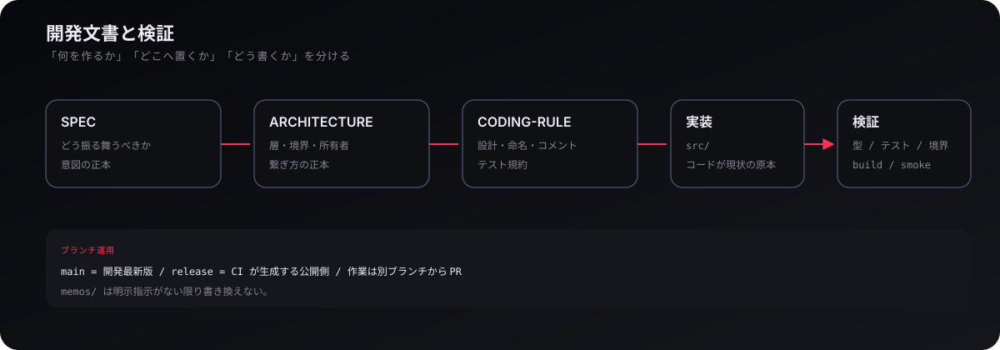
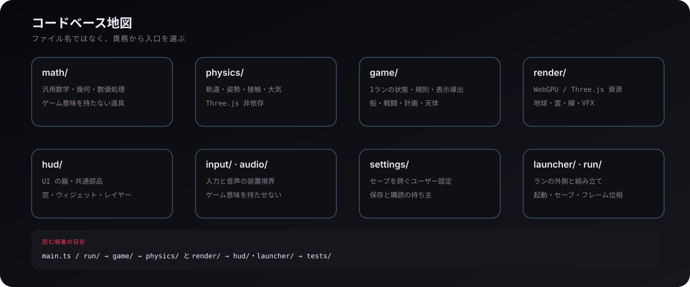

<p align="center">
  
</p>

<p align="center">
  <a href="README.md"><strong>README</strong></a>
  ·
  <a href="DEVELOP/SPEC/README.md"><strong>SPEC</strong></a>
  ·
  <a href="DEVELOP/ARCHITECTURE.md"><strong>ARCHITECTURE</strong></a>
  ·
  <a href="DEVELOP/CODING-RULE.md"><strong>CODING-RULE</strong></a>
  ·
  <a href="CONTEXT.md"><strong>用語集</strong></a>
</p>

この Wiki は、**Dive into Tepui のコードベースをどこから読めばよいか**を案内する文書です。個々のクラスや関数を網羅するのではなく、責務、状態の流れ、主要サブシステム、開発時に従う文書と検証方法を章ごとにまとめます。

> [!IMPORTANT]
> **コードの現在はコードだけが原本です。** この Wiki はコードを読むための地図です。ゲームが「どう振る舞うべきか」は [SPEC](DEVELOP/SPEC/README.md)、層と境界は [ARCHITECTURE](DEVELOP/ARCHITECTURE.md)、コードの書き方は [CODING-RULE](DEVELOP/CODING-RULE.md) を参照してください。

## 目次

1. [第1章 文書の役割](#第1章-文書の役割)
2. [第2章 コードベース全体](#第2章-コードベース全体)
3. [第3章 実行時の状態とフレーム](#第3章-実行時の状態とフレーム)
4. [第4章 物理・軌道力学](#第4章-物理軌道力学)
5. [第5章 ゲームモデル](#第5章-ゲームモデル)
6. [第6章 描画](#第6章-描画)
7. [第7章 HUD・入力・基準座標系](#第7章-hud入力基準座標系)
8. [第8章 船体・ドッキング](#第8章-船体ドッキング)
9. [第9章 起動・設定・保存](#第9章-起動設定保存)
10. [第10章 開発方針](#第10章-開発方針)
11. [第11章 テストと検証](#第11章-テストと検証)
12. [第12章 読み始める順番](#第12章-読み始める順番)

---

## 第1章 文書の役割

<p align="center">
  
</p>

このリポジトリでは、文書の役割を分けています。

| 文書 | 役割 |
| --- | --- |
| [README.md](README.md) | ゲームと技術の入口 |
| **WIKI.md** | コードベースを読むための地図 |
| [DEVELOP/SPEC/](DEVELOP/SPEC/) | ゲームがどう振る舞うべきか |
| [DEVELOP/ARCHITECTURE.md](DEVELOP/ARCHITECTURE.md) | 層、import、状態所有、フレーム位相 |
| [DEVELOP/CODING-RULE.md](DEVELOP/CODING-RULE.md) | 設計、命名、コメント、テストの規則 |
| [CONTEXT.md](CONTEXT.md) | 船体などのドメイン用語 |
| [AGENTS.md](AGENTS.md) | リポジトリで作業するときの進め方 |
| `memos/` | 人間が管理する計画・検討・記録 |

SPEC はコードの現況説明ではありません。現行実装を調べるときは `src/` と `tests/` を読みます。

---

## 第2章 コードベース全体

<p align="center">
  
</p>

### `src/` の入口

| 場所 | 主な責務 |
| --- | --- |
| `src/math/` | ベクトル、四元数、幾何、探索、空間データ構造 |
| `src/physics/` | 軌道、重力、姿勢、接触、大気、熱、座標系 |
| `src/game/` | 1ランの状態、戦闘、船体、軌道計画、天体、表示導出 |
| `src/render/` | Three.js / WebGPU、地球、雲、線、VFX、GPU 資源 |
| `src/hud/` | HUD の器、ウィンドウ、ウィジェット、レイヤー |
| `src/input/` | 生のキーボード・ポインタ入力 |
| `src/audio/` | BGM と効果音の出力 |
| `src/settings/` | セーブを跨ぐユーザー設定 |
| `src/launcher/` | タイトル、ステージ開始、セーブスロット、結果画面 |
| `src/run/` | ラン全体の組み立てとフレーム処理 |
| `src/main.ts` | アプリケーションの起動 |

### `tests/`

テストは `math/`、`physics/`、`game/`、`render/`、`launcher/`、`settings/` など、対象の層に対応して分かれています。

---

## 第3章 実行時の状態とフレーム

<p align="center">
  
</p>

基本原則は、**捨てたときに他から作り直せるか**です。

- 位置・速度・燃料・損傷など、失うと復元できない値はモデル側の正本です。
- HUD、マーカー、軌道線、GPU 表示資源は正本から導出します。
- 描画や DOM はゲーム世界の正本を書きません。
- 外部入力から来た変更は、命令として進行側へ渡します。

毎フレームは概ね次の順で進みます。

```text
入力の解釈
    ↓
シミュレーション進行
    ↓
表示状態の導出・同期
    ↓
描画
```

位相と状態所有の厳密な規則は [ARCHITECTURE](DEVELOP/ARCHITECTURE.md) が正本です。

---

## 第4章 物理・軌道力学

<p align="center">
  
</p>

`src/physics/` は Three.js に依存しない物理層です。主要な入口は次のとおりです。

| 分野 | 主なファイル |
| --- | --- |
| 運動方程式・摂動 | `dynamics.ts`, `dynamic-trajectory.ts` |
| 軌道要素 | `elements.ts`, `kepler-orbit.ts`, `kepler-extrapolation.ts` |
| ラグランジュ点・三体問題 | `lagrange.ts`, `cr3bp.ts`, `halo.ts`, `zero-velocity.ts` |
| 座標系 | `frame.ts`, `eci-transform.ts`, `icrf.ts`, `ecliptic.ts` |
| 姿勢 | `attitude.ts` |
| 大気・熱 | `atmosphere.ts`, `thermal.ts` |
| 太陽放射圧・遮蔽 | `srp.ts`, `shadow.ts`, `occlusion.ts` |
| 接触・衝突 | `*-contact.ts`, `collision-response.ts` |
| 迎撃 | `intercept.ts` |

J2 は扁平による軸対称な2次重力項、C22 は経度方向の非軸対称性を扱います。ラグランジュ点は回転系で求めた後、表示や航法で使える ECI 状態へ変換されます。

---

## 第5章 ゲームモデル

`src/game/` は一回のプレイ中に必要な状態と規則を持ちます。

| 場所 | 内容 |
| --- | --- |
| `game/ship/` | ShipAssembly、モジュール、質量、保存 |
| `game/combat/` | 射撃、被弾、戦闘処理 |
| `game/plan/` | マニューバーノード、Δv 編集、予測表示 |
| `game/celestial/` | 天体モデル、太陽系、ラグランジュ点表示 |
| `game/dynamic/` | 動く実体と運動 |
| `game/player/` | プレイヤー機と操作対象 |
| `game/stages/` | ステージルール |
| `game/creative/` | CREATIVE 配置 |
| `game/viewer/` | カメラ・ビューなどの視点状態 |
| `game/hud/` | ゲーム固有 HUD |
| `game/marker/`, `game/lines/` | マーカーと軌道線の表示導出 |

### 軌道計画

<p align="center">
  
</p>

`game/plan/` はノード列とその編集を扱います。ノードは噴射後の絶対状態を持ち、上流ノードを変更すると下流の凍結状態は破棄されます。画面上のノードと Δv 軸操作は、モデルの計画状態とは別の表示・入力層から扱います。

---

## 第6章 描画

<p align="center">
  
</p>

`src/render/` は、3D / GPU 資源の構築・所有・同期・破棄を担当します。

### 地球

地球表面は多数の `earth-surface-*` モジュールに分かれ、タイル取得、デコード、要求列、常駐管理、ページテーブル、GPU 材質までを扱います。地表とは別に `atmosphere.ts`、`cloud/`、`airglow.ts`、`aurora-field.ts` が存在します。

### その他

`render/lines/` は軌道線、`render/plan/` は軌道計画表示、`render/protein/` はタンパク質構造、`render/vfx/` は視覚効果を担当します。

描画側へゲームの正本を持ち込まず、供給された表示状態を GPU / Three.js へ同期するのが境界の基本です。

---

## 第7章 HUD・入力・基準座標系

<p align="center">
  
</p>

共通 UI の器は `src/hud/`、ゲーム固有の軌道・艦・敵・計画パネルは主に `src/game/hud/` にあります。

マップビューでは、表示の原点と回転を分けて扱います。コード上では慣性系、公転回転系、自転系を選択でき、予測軌道やマーカーは表示時刻に応じた座標変換を受けます。

生のキー・ポインタ状態は `src/input/` が受け持ち、ゲーム意味への解釈はゲーム側で行います。

---

## 第8章 船体・ドッキング

<p align="center">
  
</p>

船は単一の固定モデルではなく **ShipAssembly** として扱われます。`cockpit`、`tank`、`thruster`、`RCS`、`weapon`、`dock`、`radiator`、`solar_panel`、`booster` などのモジュール実体と接続辺が船体構造を作ります。

ドッキング後は接続された船体が一つの統合船体になり、保存もモジュール単位の状態を含みます。用語の正本は [CONTEXT.md](CONTEXT.md) です。

---

## 第9章 起動・設定・保存

### `launcher/`

`src/launcher/` はランの外側を担当します。

- タイトル画面とステージ選択
- 開始時刻の入力
- セーブブラウザ
- スナップショット
- 解放状況
- 結果画面

### `settings/`

`src/settings/` はセーブを跨いで共通するユーザー設定を持ちます。描画品質や UI 設定など、個々のランではなくアプリケーション全体に属する値の持ち主です。

### セーブ

ゲーム状態の直列化と復元は、各状態所有者が自分の持ち物を保存する形で構成されています。ブラウザ側の保存管理は `launcher/save/` 系モジュールが担当します。

---

## 第10章 開発方針

<p align="center">
  
</p>

### 正本を混ぜない

- **現在の実装**: コード
- **望ましい振る舞い**: SPEC
- **層・import・状態所有**: ARCHITECTURE
- **コードの書き方**: CODING-RULE
- **作業手順**: AGENTS
- **用語**: CONTEXT

### 変更の原則

[CODING-RULE](DEVELOP/CODING-RULE.md) では、物理的正確さ、責務分割、疎結合、可読性を優先します。特に `physics/` では、見た目だけを理由に勝手な近似を持ち込まないことが明示されています。

[ARCHITECTURE](DEVELOP/ARCHITECTURE.md) では、正本の書き手を一つにし、import を不変な側へ向け、装置層がゲーム意味を所有しないことを定めています。

### ブランチ

- `main`: 開発最新版
- `release`: CI が生成する公開側
- 通常の変更: 作業ブランチ → PR → `main`

`release` は手で編集しません。

### `memos/`

`memos/` は人間が管理する作業記録です。明示指示がない限り書き換えません。

---

## 第11章 テストと検証

変更した層に対応するテストを使います。

| コマンド | 用途 |
| --- | --- |
| `npm run typecheck` | 型検査。通常の変更で常に実行 |
| `npm run test:math` | 数学層 |
| `npm run test:physics` | 物理層 |
| `npm run test:game` | ゲーム層 |
| `npm run test:render` | 描画層 |
| `npm run test` | 全テスト |
| `npm run lint` | ESLint |
| `npm run check:boundaries` | 層・import 境界 |
| `npm run build` | 本番ビルド |
| `npm run smoke:browser` | ブラウザ起動・操作のスモーク |
| `npm run ci` | 総合検証 |

### 実験環境

| コマンド | 用途 |
| --- | --- |
| `npm run render-lab` | 描画の独立検証 |
| `npm run cloud-lab` | 雲の独立検証 |
| `npm run bgm-lab` | BGM 試聴 |

地球表面やタンパク質には、取得・生成・検証のための専用 `tools/` と npm スクリプトがあります。

---

## 第12章 読み始める順番

### ゲーム全体を追う

1. `src/main.ts`
2. `src/run/run.ts`
3. `src/game/game.ts`
4. 興味のある `src/game/*/`
5. そこで使われる `src/physics/` と `src/render/`

### 軌道力学から入る

1. `src/physics/kinematic-state.ts`
2. `src/physics/elements.ts`
3. `src/physics/dynamics.ts`
4. `src/physics/frame.ts`
5. `src/physics/lagrange.ts` / `cr3bp.ts`
6. `src/game/plan/`

### 地球描画から入る

1. `src/render/earth-surface.ts`
2. `src/render/earth-surface-runtime.ts`
3. `src/render/earth-surface-tiles.ts`
4. `src/render/atmosphere.ts`
5. `src/render/cloud/`
6. `src/render/airglow.ts` / `aurora-field.ts`

### 船体から入る

1. [CONTEXT.md](CONTEXT.md)
2. `src/game/ship/`
3. `src/physics/ship-mass-properties.ts`
4. `tests/game/ship-assembly.test.ts`

---

<p align="center">
  <a href="README.md"><strong>← README に戻る</strong></a>
  ·
  <a href="DEVELOP/SPEC/README.md"><strong>SPEC を読む</strong></a>
  ·
  <a href="DEVELOP/ARCHITECTURE.md"><strong>ARCHITECTURE を読む</strong></a>
</p>
