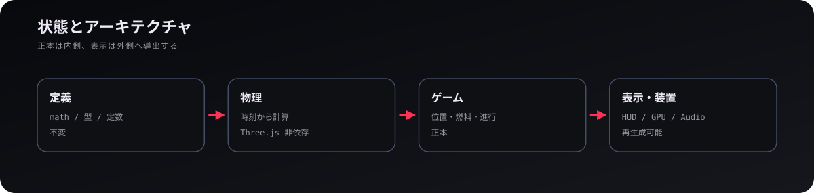
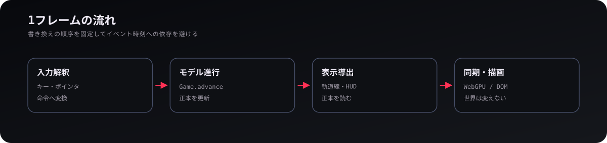
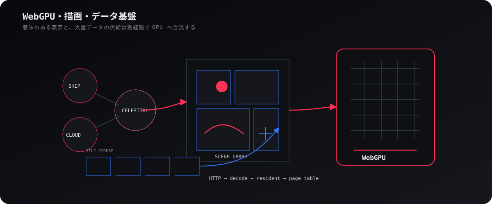
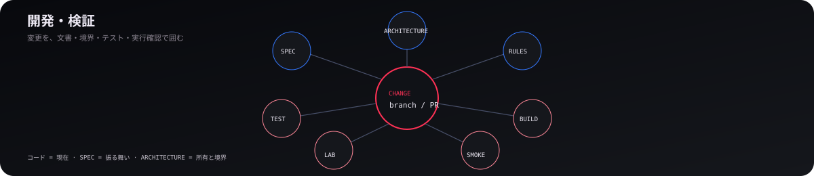

# 技術

## 1. 状態とアーキテクチャ

  

本プロジェクトの設計では、状態（値）を機能単位ではなく**破棄したときに再生成できるか**で分類する。位置・速度・燃料・損傷のように復元できない値はモデルの正本とし、軌道線・HUD・GPUリソースのように再生成できる値は導出値（キャッシュ）として扱う。この区別により、描画を破棄してもゲーム状態は失われず、表示設定を変えても物理結果は変わらない。

依存は概ね、不変な数学・物理 → ゲームモデル → 表示導出 → GPU / DOM / Audio の順に流れる。プレゼンターや入出力デバイス層（描画・音声・入力）はゲームの論理状態を持たず、モデルの更新窓口も状態の所有者だけに限定することで、同一の状態が複数箇所から意図せず書き換えられるのを防いでいる。

| 層 | 例 | 可変状態 |
| --- | --- | --- |
| 定義 | `math/`, 型、定数 | 原則なし |
| 時刻依存 | `physics/` | 結果を変えないキャッシュのみ |
| モデル | `game/` | 位置、燃料、進行、視点などの正本 |
| 導出・装置 | `render/`, `hud/`, `audio/`, `input/` | 再生成可能な表示・入出力状態 |

## 2. 1フレームの流れ

  

1フレームは **入力解釈 → モデル進行 → 表示導出 → 同期・描画** の順で進む。ブラウザイベントの発生時に直接宇宙船を動かすのではなく、入力を操作量やコマンドへと変換したうえで、フレーム内の所定の更新フェーズでゲーム状態へ適用する。これにより、DOMイベントの発生時刻にゲーム結果が依存しない。

`src/run/run.ts` の `Run` がこの順序を組み、`Game` がモデル、`GamePresentation` が入力解釈と表示導出を束ねる。セーブはモデル進行が確定した後、表示資源へ同期する前の状態を直列化するため、GPUやDOMの一時状態を保存する必要がない。

## 3. WebGPU・描画・データ基盤

  

描画は Three.js の WebGPU renderer と TSL を中心に構成される。宇宙船・天体・軌道線・雲の表示内容はゲームモデル側が定義し、`render/` はその宣言的な状態を受け取って Three.js や GPU リソースへとマッピングする。GPUリソースは **構築・同期・破棄** のライフサイクルを分離し、毎フレームの同期で geometry や texture を無制限に再生成しないようにしている。

地球表面のような大規模データは、必要範囲だけを **タイル要求 → HTTP → デコード → 常駐管理 → ページテーブル → GPUマテリアル** の順で流す。カメラ移動で不要になった古い要求は世代管理によって破棄し、通信・デコード・GPU転送のキューを個別に流量制限することで、テクスチャを高精細化してもメインループの描画がブロックされない構造にしている。

## 4. 開発・検証

  

開発では、**現在の実装＝コード、望ましい挙動＝SPEC、置き場と所有＝ARCHITECTURE、書き方＝CODING-RULE** と役割を分ける。仕様書を実装済み一覧にせず、コードの現状を文書へ重複して写さないことで、更新時の齟齬を減らしている。

通常の変更では `npm run typecheck` を基準とし、触った層に応じて `test:physics`、`test:game`、`test:render` などを追加する。import境界は `check:boundaries`、実ブラウザは `smoke:browser`、描画は Render Lab / Cloud Lab で確認する。mainへ送る前は全体テストとbuildまで通し、releaseはCIが生成する。

  <a href="README.md"><strong>← WIKI</strong></a>
  ·
  <a href="02-solar-system.md"><strong>太陽系 →</strong></a>

