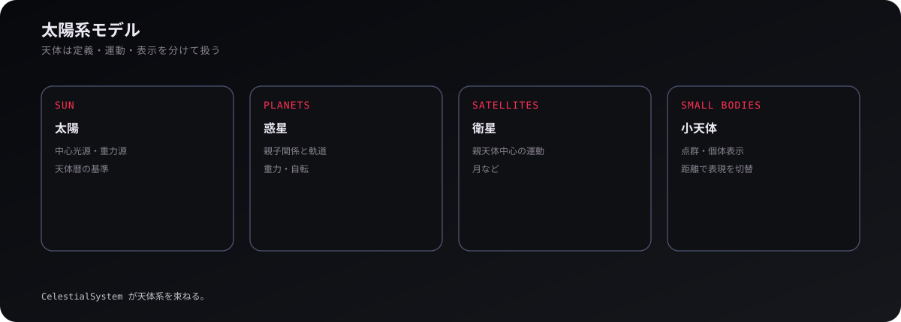
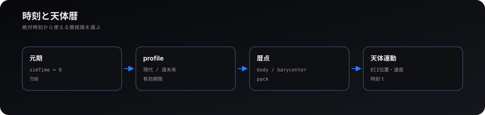
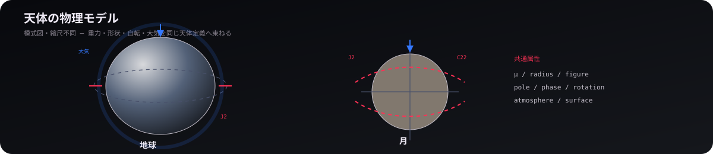
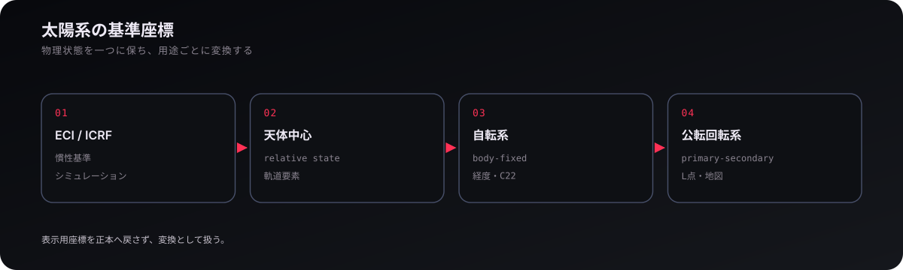

# 太陽系

## 1. 天体階層

  

太陽系は `CelestialSystem` の中で、太陽・惑星・衛星・準惑星・小天体を同じ天体系として束ねる。各天体は静的な定義、時刻から決まる運動、描画表現を分けて持ち、地球系・木星系などの構築関数を合成して一つの太陽系を作る。ECI の原点天体はステージ側から選べるため、同じ天体集合を地球中心や別天体中心で扱える。

階層は表示だけの分類ではなく、親天体、同一惑星系、主引力天体、ラグランジュ点の親などを解決する基盤でもある。マップで「現在の系だけを詳しく見せる」ときも、カメラ位置と重力関係から系の所属を判定する。

## 2. 時刻と天体暦

  

天体配置は絶対時刻に依存するため、各ランは `simTime = 0` に対応する元期を持つ。遠未来を含む天体力学では UTC の暦表現ではなく TDB を基準にし、保存時も「経過秒だけ」でなく元期を含む天体暦の文脈を保持する。

数値暦は、収録期間に入る場合だけ対応する暦プロファイルを読み込む。現在は JPL DE440 に基づく現代用と、DE441 へ接続した遠未来用の暦パックがあり、期間外では解析暦へ戻る。数値暦の天体本体と惑星系重心を誤って結ぶと系全体が重心オフセット分ずれるため、`CelestialSystem` が暦点を運動ノードへ一度だけ結び付ける。

## 3. 天体の物理モデル

  

天体定義には、標準重力パラメータ `μ = GM` [m³/s²]、半径・楕円体形状、自転、軌道、2次重力場、大気などが入る。地球は J2 を主に使い、月は J2 に対して C22 が大きいため非軸対称項も扱う。これらは「見た目の設定」ではなく軌道・接触・大気抵抗の入力になる。

地球大気は回転楕円体と高度別密度層を持ち、描画用の大気光学とは別定義である。同様に、天体の衝突半径、重力場の基準半径、表面描画の半径も目的が違うため、数値が近くても一つの量へ統合しない。

## 4. 基準座標系・照明・表示

  

`ReferenceFrames` は、天体運動から「どの座標系が存在し、時刻ごとに原点・姿勢・角速度がどうなるか」を供給する。慣性系、公転回転系、自転系の変換自体は `physics/frame.ts` の純関数が担い、ゲーム側は天体や衛星の関係から使用可能なフレームを組み立てる。

描画では恒星光源、天体の影、大気、環、星野、経緯線、軌道ガイドを `CelestialSystem` が同期する。遠距離ではすべてを実寸表示すると見えないため、LOD や点表示を使うが、表示サイズを変えても重力半径や物理状態は変えない。

  <a href="01-technology.md"><strong>← 技術</strong></a>
  ·
  <a href="README.md"><strong>WIKI</strong></a>
  ·
  <a href="03-orbits.md"><strong>軌道 →</strong></a>

