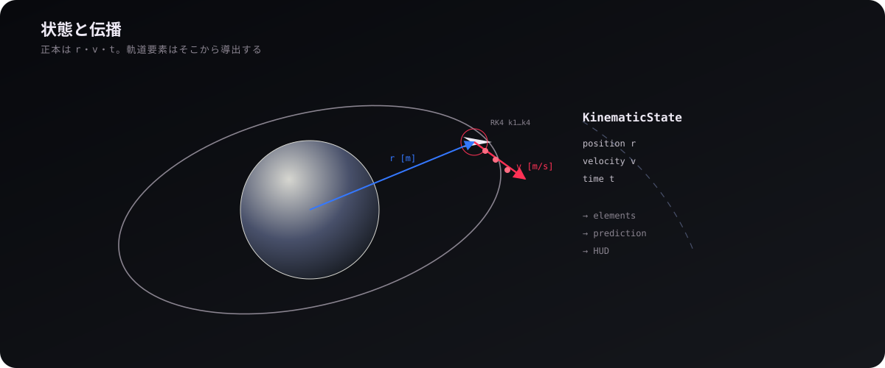
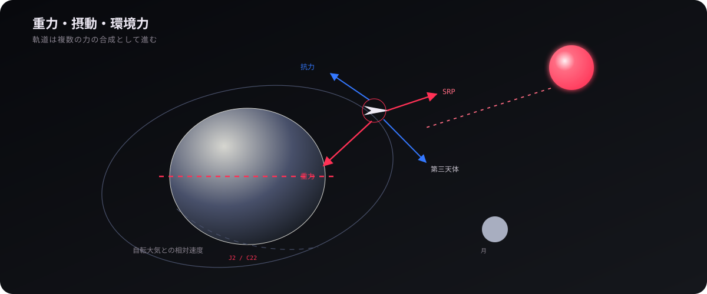
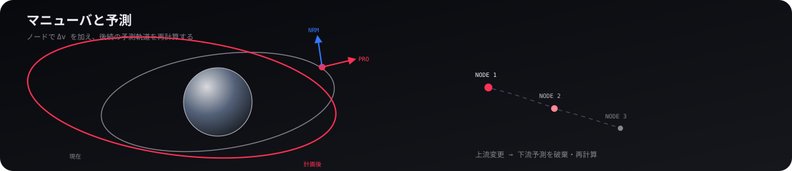
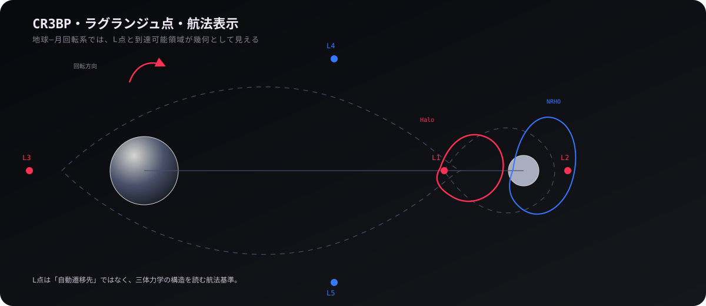

# 軌道

## 1. 状態と伝播

  

軌道の正本は基本的に **位置 `r` [m] と速度 `v` [m/s]** で、独自の `Vec3` / `KinematicState` は地球中心慣性系 ECI を既定とする。軌道要素は表示や解析に便利だが、時間発展の正本として二重に持たず、状態ベクトルから導出する。

動的運動は RK4 を中心に数値積分する。各段ではその段の時刻における天体位置と外力を評価し、時間加速中でも「ステップ開始時の重力場を固定して使う」といった近似へ落とさない。二体問題として扱える予測では Kepler 外挿も使い、必要な精度と計算量に応じて役割を分ける。

## 2. 重力・摂動・環境力

  

加速度は点質量重力だけでなく、J2/C22、多体重力、大気抵抗、太陽放射圧などを合成する。J2 は扁平による軌道面・近点の歳差を生み、C22 は天体固定経度との関係を持つ。大気抵抗では ECI速度そのものではなく、自転する大気に対する相対速度を使う。

太陽放射圧や熱計算では日照・遮蔽も必要になる。描画上の影と物理上の遮蔽は目的が異なるが、どちらも同じ天体幾何を基礎にする。大気圏では空力荷重・加熱・燃え尽きまで連続して扱う。

## 3. マニューバと予測

  

マニューバーノードは「画面上の矢印」ではなく、実行時刻と Δv を持つ未来状態の編集点である。Δv は順行/逆行、軌道面法線、動径方向の軸へ分けて編集し、上流ノードを変えると下流予測も再計算する。プレイヤーは予測軌道を見てノードを配置し、最適遷移を自動生成する方式にはしていない。

予測軌道は表示のためのキャッシュで、実軌道の正本ではない。マップや HUDが要求した時間範囲まで `Predictor` が伸ばし、表示期間を短くしても世界の進行結果は変わらない。

## 4. CR3BP・ラグランジュ点・航法表示

  

`cr3bp.ts` は円制限三体問題を扱い、地球–月のような二天体系を回転座標系で見る基礎になる。L1〜L5 はこの回転系で固定されるが、ゲーム内で配置・表示するときは各時刻の ECI 状態へ変換する。Halo 軌道やゼロ速度曲線も、同じ三体問題の幾何を理解するための別概念である。

マップでは表示原点と回転を分け、慣性・公転回転・自転フレームを選べる。未来軌道の各点は**その点自身の時刻**で回転系へ変換するため、現在時刻の姿勢を全点へ一括適用して軌道線を歪めない。

  <a href="02-solar-system.md"><strong>← 太陽系</strong></a>
  ·
  <a href="README.md"><strong>WIKI</strong></a>
  ·
  <a href="04-weather.md"><strong>気象 →</strong></a>

