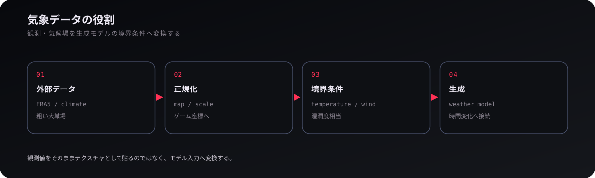
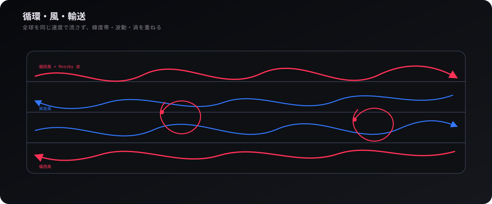
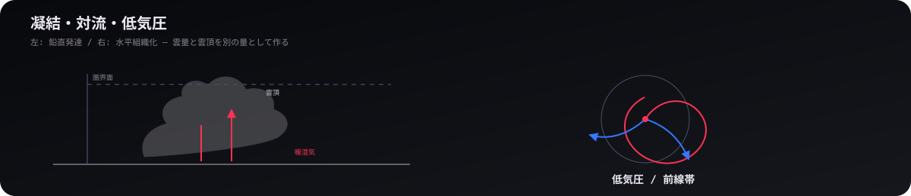
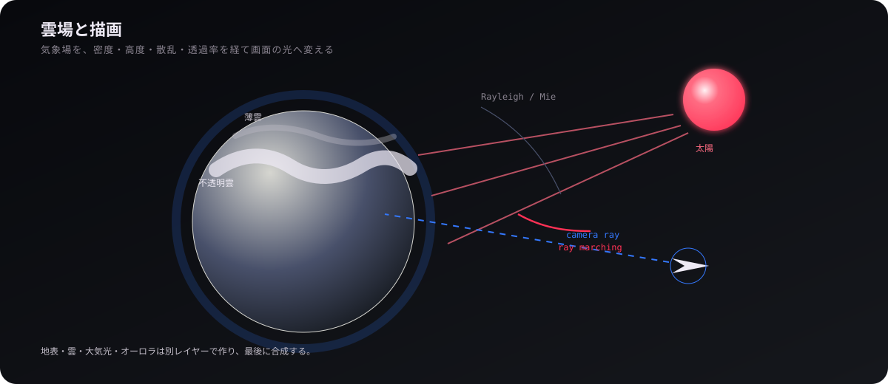

# 気象

## 1. 気候場と気象状態

  

地球の雲は静的なテクスチャの貼り付けではなく、`GeneratedCloudField` が動的に生成する時間変化する気象場に基づいている。平年値を与える `AnnualClimateMap` を入力とし、`WeatherModel` が湿度・上昇流・暖気流入・対流活動度・前線帯・圏界面高度などの雲生成パラメータへと変換する。

この層の目的は全球の数値予報を再現することではなく、気象衛星で見える**数百〜数千 km の組織構造と時間変化**を、描画可能な場として生成することにある。低気圧は時刻から決まるトラックと気圧の谷として手続き的に与え、その影響を風速場や湿度、対流活動へと伝播させ、そこから雲の空間形状を導出している。

## 2. 循環・風・輸送

  

`Circulation` と `AtmosphericWind` は、緯度帯の東西流と南北成分を組み合わせて気団を運ぶ。自転に伴う帯状流、プラネタリー波（ロスビー波）、局所的な気団ノイズを異なる空間スケールで重畳させることで、雲テクスチャを一律の速度で回転させるような不自然さを排し、現実的な大気のうねりを表現している。

`WeatherTransport` は、湿度や気団特性をこの流れに沿って運ぶ。隣接する緯度帯の間は滑らかに混合させ、境界部で風向が急変（不連続にジャンプ）するのを防ぐ。移流計算と雲の凝結プロセスを分離しているため、雲が消散しても背景の気象場は独立して保持される。

## 3. 凝結・対流・低気圧

  

`condensation.ts` は、気象状態から雲の被覆率・雲頂高度・薄雲の光学量を作る。低層湿度は不透明雲の被覆率、上昇流と暖気流入は層状雲の雲頂高度、対流活動度は積乱雲の雲塔、上層湿度は巻雲などの薄雲の分布をそれぞれ左右する。これにより、雲量と雲頂高度が単一のノイズ値で一律に決まってしまう不自然さを避けている。

対流活発度は低周波の不安定度、上昇流、寒気流入、陸面、前線帯から作る。低気圧の位置や進路には手続き的な規則を使う一方、前線・対流塔・海洋性層積雲は気圧・湿度・上昇流などの場から連続的に現れるよう構成している。

## 4. 雲場と描画

  

気象モデルの出力は `CloudField` を経由して描画系へ渡され、`CloudPresentation` がカメラ（観測点）から見える球面領域（球面キャップ）のテクスチャへと必要範囲をレンダリング（ベイク）する。動的生成による雲場と、実写衛星画像から作成した雲場は共通の投影・描画インターフェースに準拠しているため、検証用データと本番生成を全く同じシェーダーパイプライン上で比較・評価できる。

描画では不透明雲と半透明雲を分け、雲頂高度・被覆率・薄雲の光学的厚みをそれぞれ使う。地球大気の Rayleigh / Mie 散乱、大気光、オーロラは雲とは別レイヤーで、最終的に地表・照明と合成する。Cloud Lab は生成雲を固定条件で撮影・実写比較するための独立検証環境である。

  <a href="03-orbits.md"><strong>← 軌道</strong></a>
  ·
  <a href="README.md"><strong>WIKI</strong></a>
  ·
  <a href="05-game-systems.md"><strong>ゲームシステム →</strong></a>

