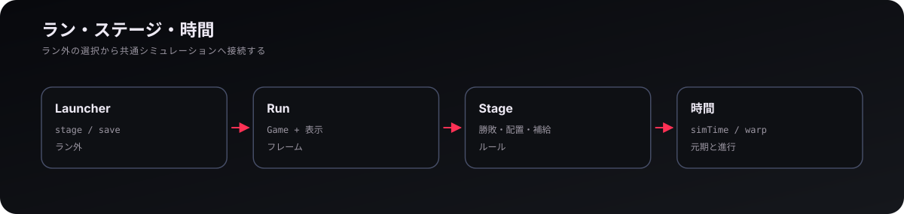
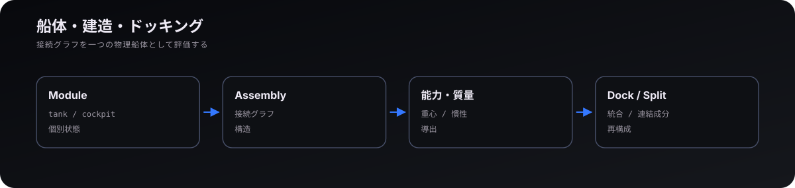
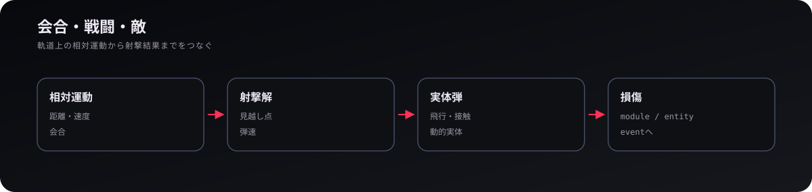
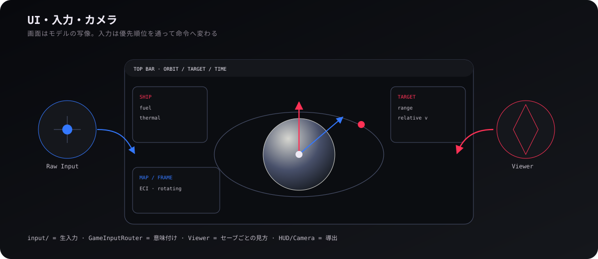
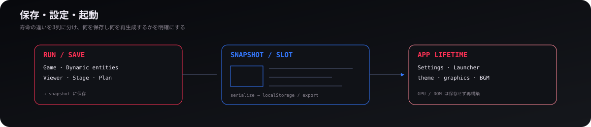

# ゲームシステム

## 1. ラン・ステージ・時間

  

1回のゲームセッション（ラン）は、`Run` がゲームモデル `Game` と各種表示系を統括することで成立し、`Stage` が勝敗条件や初期配置、補給ルールを規定する。Stage 00〜2、CREATIVE、debug系は同じ Game / DynamicSystem を共有し、ゲームモードごとに別の物理エンジンを持たない。

時間加速は `SimSpeedManager` がモデル状態として持ち、ポーズとは別に扱う。各ステージは固有の開始元期（基準時刻）を持つため、開始時刻を変更すれば太陽や月、天体の影の配置も連動して変化する。結果画面や次のランへの遷移は、ラン外の `launcher/` が担当する。

## 2. 船体・建造・ドッキング

  

宇宙船は固定的な3Dモデルではなく、各モジュール（ノード）とそれらの結合関係（エッジ）で構成される **ShipAssembly**（グラフ構造）として表現される。`cockpit`、`tank`、`thruster`、`RCS`、`weapon`、`dock`、`solar_panel`、`radiator`、`booster` などが個別状態を持ち、総質量・重心・慣性・能力は船体構造から導出する。

ドッキングでは二隻を「親子のまま追従」させず、接続後の一つのアセンブリとして質量特性を再計算する。分離では接続グラフを切り、連結成分ごとに船体を再構成する。描画用の3Dメッシュは単なる見た目の表現にすぎず、当たり判定（衝突形状）やセーブデータの正本はアセンブリの論理構造そのものである。

## 3. 会合・戦闘・敵

  

本作の戦闘は軌道力学と不可分であり、敵との距離だけでなく、相対速度ベクトルや機体姿勢、弾速が射撃の成否を決定づける。見越し点は目標運動と実体弾の飛行時間から計算し、弾は接触・寿命を持つ動的エンティティとして扱う。高倍率時間加速では射撃を制限し、戦闘の時間分解能を保つ。

被弾は接触 → 損傷 → 船体/実体状態の変更 → イベント記録 → 音・閃光・通知という流れで処理する。タンパク質型エネミーも宇宙船と同様に `DynamicSystem` 内の動的エンティティとして管理されており、外見や挙動が特異であっても、軌道運動や交戦処理の基盤システムは共通である。

## 4. UI・入力・カメラ

  

`input/` はキー・マウス・タッチの生イベントを集め、`GameInputRouter` が機能ごとの優先順位に従って配る。モーダルダイアログの表示中、船体建造中、ポーズ中など、コンテキストに応じて通過させる入力イベントをフィルタリングし、同一のキー入力が複数の機能で二重に誤作動しないよう優先度（イベント消費順）を制御している。

カメラ位置や注視ターゲット、マップの参照座標系、軌道予測の表示範囲といった「視点・観測状態」はセーブデータごとに `Viewer` が保持する。一方、カラーテーマや描画品質、音量設定のようにセーブを跨いで引き継がれるユーザー環境設定は `UserSettings` が一元管理する。Three.js Camera や DOMはこれらの正本ではなく、毎フレーム同期される表示資源である。

## 5. 保存・設定・起動

  

セーブは位置・速度・船体・ステージ・時間加速・Viewerなど、再生成できないモデル状態を直列化する。GPU テクスチャ、メッシュ、DOM、軌道線などは保存せず、ロード時に新しく作り直す。元期と `simTime` の組も保持するため、復元後の天体配置が保存時と一致する。

`launcher/save/` はスロット、スナップショット、自動保存、入出力を管理し、`settings/` はアプリ共通設定を管理する。Launcher → Run / Game という一方向の依存関係を徹底することで、個々のランが次ステージへの遷移ルールや `localStorage` の永続化仕様に直接依存しない、疎結合な設計を保っている。

  <a href="04-weather.md"><strong>← 気象</strong></a>
  ·
  <a href="README.md"><strong>WIKI</strong></a>
  ·
  <a href="../README.md"><strong>プロジェクト README →</strong></a>

