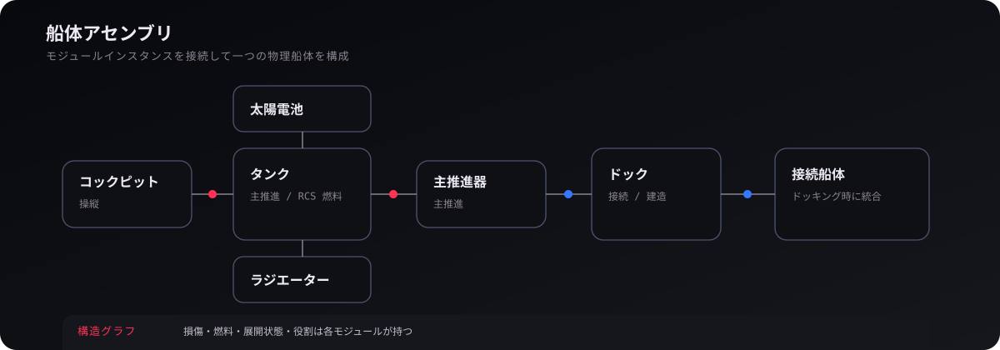
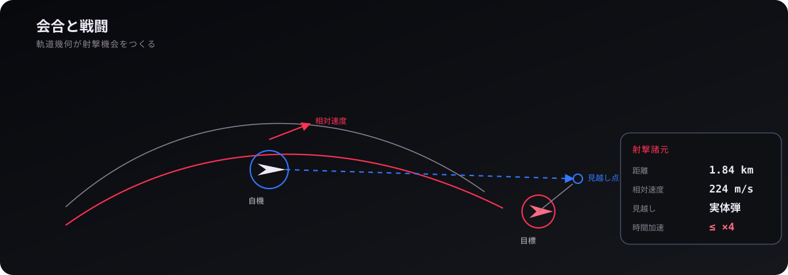

# 06. 船体・戦闘

  

Dive into Tepui の船は、一個の固定 3D モデルではなく、**モジュール実体と接続辺からなる ShipAssembly** として扱われます。戦闘もこの構造の上に乗るため、船体・推進・ドッキング・損傷・射撃を一緒に読むと理解しやすくなります。

## 1. ShipAssembly が表すもの

ShipAssembly は「ひとつの物理船体として動く接続グラフ」です。

ノード側には module instance、辺側には module connection を持ちます。

モジュール例:

- cockpit
- tank
- thruster
- RCS
- weapon
- dock
- solar panel
- radiator
- booster
- decoupler

接続例:

- 構造接続
- ドッキング接続
- 建造上の接続
- 分離可能接続

## 2. Definition と Instance

モジュール定義と、実際に船へ載っているモジュール実体は分けます。

### Definition

型として変わらないもの。

- 寸法
- 容量
- 基本質量
- 接続点
- 種別
- 性能上限

### Instance

ラン中に変化するもの。

- 燃料残量
- HP
- 展開状態
- 点火状態
- 故障状態
- 接続先
- 一意 ID

この分離により、同じ種類のタンクを複数載せても、それぞれ別の状態を持てます。

## 3. ship-module-catalog

`ship-module-catalog.ts` は利用可能なモジュール定義を引く入口です。

建造 UI やプリセットは、直接「この型ならこう描画する」と分岐するより、カタログにある定義を参照します。

## 4. ShipAssembly の検証

`ship-assembly-validation.ts` は、接続グラフが有効かを確認します。

グラフ構造では、単なる配列より次の問題が増えます。

- 存在しない module ID を参照
- 同じ接続点を二重使用
- 無効な自己接続
- 循環自体は許せても意味的に不正な接続
- 分離後に孤立する構造
- cockpit のない残骸

検証を一箇所にまとめることで、建造 UI とセーブ復元が別々の規則を持たないようにします。

## 5. 船体全体の集計

`ship-assembly-totals.ts` は、複数モジュールから船体全体の量を集計する入口です。

代表的には、

- 総質量
- 燃料量
- 推進能力
- 電力
- 放熱
- 武装
- 操作能力

などです。

重要なのは、集計値を第二の正本として固定保存しないことです。モジュール状態から再計算できるものは導出できます。

## 6. 質量特性

`src/physics/ship-mass-properties.ts` は、船体の質量分布を物理側へ渡す重要な接点です。

船体がモジュール構造なら、

- 重心
- 慣性モーメント
- 総質量

は組み合わせによって変わります。

燃料消費や分離で質量分布が変われば、回転運動にも影響します。

## 7. ShipAssembly transform

`ship-assembly-transform.ts` は、各モジュールのローカル配置を船体全体の座標へ写すための入口です。

グラフ上の接続と、3D 空間上の位置・姿勢を混同しないことが重要です。

## 8. ShipPhysicsShape

`ship-physics-shape.ts` は、船体構造を衝突・接触判定用の形へ写します。

描画 Mesh をそのまま衝突形状として使わないことで、

- 描画 LOD
- 装飾
- schematic 表現
- 非表示部品

が物理判定へ漏れません。

## 9. ModularShip

`modular-ship.ts` は ShipAssembly を持つ実際の動的エンティティ側です。

ShipAssembly が「構造」を表すのに対し、ModularShip は、

- 運動
- 制御
- ゲーム上の実体
- 描画への接続
- 出来事

を含むラン中の個体です。

## 10. 推進

主推進器と RCS は役割が違います。

### 主推進

大きな Δv を得るための推進。

### RCS

姿勢・細かな並進制御。

どちらも燃料を消費しますが、入力、推力方向、制御目的が異なります。

## 11. PilotControls

プレイヤー入力は、そのまま各 thruster の ON/OFF へ直結しません。

まず「前進」「ヨー」「ロール」などの操作量として解釈し、船体の能力へ写します。

これによりモジュール構成が変わっても、入力体系そのものは保てます。

## 12. booster

booster は、外部タンクから燃料を引く一般 thruster と違い、自己完結した固体燃料推進として扱います。

点火・燃焼・分離のライフサイクルが明確です。

## 13. solar panel と radiator

太陽電池・ラジエーターは、見た目だけの可動部ではありません。

- 展開状態
- 発電
- 熱
- 損傷
- 向き

などと関係します。

描画側のアニメーション状態と、ゲーム上の展開状態を混同しないようにします。

## 14. ドッキング

`ship-docking.ts` は、別々の船体を接続する処理を扱います。

ドッキング成立には一般に、

- 接続可能ポート
- 距離
- 軸方向
- 相対速度
- ポートの空き
- 操作可能な cockpit

などが関係します。

成立後は「親船・子船を別オブジェクトのまま追従させる」のではなく、統合された ShipAssembly として扱います。

## 15. ドッキング後の意味

統合後は、

- 質量
- 慣性
- タンク
- 推進
- 操作能力
- 保存

を一つの assembly として再評価できます。

この方式は「ドッキングした船だけ特別な例外運動をする」設計を避けます。

## 16. 分離

`ship-decoupling.ts` は、接続を切って assembly を複数へ分ける処理を扱います。

分離ではグラフを切るため、

1. edge を除去
2. 連結成分を再計算
3. 各成分を新しい assembly として確定
4. 質量特性を再計算
5. 必要なら運動状態を分ける

という考え方が必要です。

## 17. docking state

`ship-dock-state.ts` はドックの利用状態を扱う入口です。

構造上 port が存在することと、「現在空いているか」「接続済みか」は別です。

## 18. 建造

`ship-construction.ts` と `ship-construction-rules.ts` は、ゲーム内建造を扱います。

建造 UI が assembly を直接好きな形に書き換えるのではなく、ルールを通して変更します。

## 19. repair

`ship-repair.ts` は修理処理を分離しています。

損傷状態を各 UI から直接 HP 加算するのではなく、修理可能条件・対象・資源などを一つの規則へ集めます。

## 20. save

`ship-save.ts` は ShipAssembly を保存形式へ写します。

重要なのは、描画 Mesh や Three.js Object3D ではなく、

- module instance
- connection
- 個別状態
- 必要な識別

を保存することです。

## 21. プリセット

`ship-presets.ts` は、初期船や定型構成を作るための入口です。

プリセットは「特殊な船種クラス」ではなく、共通の ShipAssembly を構築するレシピとして考えると読みやすくなります。

## 22. capability

`ship-capabilities.ts` は、その assembly が現在何をできるかを導出する入口です。

例えば cockpit が破壊された場合、「見た目は船の形を保っているが操作不能」という状態を表せます。

## 23. 戦闘は軌道運動の上にある

  

戦闘は「敵までの直線距離」だけでは決まりません。

- 自機速度
- 敵速度
- 相対速度
- 弾速
- 姿勢
- 時間加速
- 遮蔽
- 船体

が同じ世界状態へ乗っています。

## 24. 見越し射撃

目標が動いている場合、現在位置を撃っても到達時にはそこにいません。

迎撃計算では、

[
mathbf{p}_{target}(t)-mathbf{p}_{shooter}(t)
]

と弾の飛行時間を整合させる必要があります。

表示上の lead marker は、この物理計算を画面へ写したものです。

## 25. 実体弾

弾は瞬間的な ray hit ではなく、動的エンティティとして飛ぶものがあります。

そのため、

- 発射時の自機速度
- 銃口方向
- 弾速
- 飛行時間
- 接触
- 寿命

が必要です。

## 26. 時間加速と射撃

高倍率時間加速中に射撃を許すと、弾の細かな時間スケールと軌道進行の時間スケールが極端にずれます。

README にあるように、射撃可能な倍率を制約することで、戦闘の時間分解能を保ちます。

## 27. 被弾と破壊

被弾は、

1. 接触
2. 損傷
3. module / entity 状態変更
4. 出来事記録
5. 表示・音への変換

という流れで考えます。

閃光や音をモデルの正本へ直接持たせないことが重要です。

## 28. 破片

破壊後の破片も物理世界に残る場合があります。

大量に出るため、描画側では instancing を使いつつ、必要な物理状態と表示状態を分けます。

## 29. sun glare spread

`game/combat/sun-glare-spread.ts` は太陽方向による照準・視認への影響に関係するゲームロジックです。

これは単なる post effect ではなく、戦闘上の意味を持つため game 側にあります。

## 30. コードを読む順番

### 船体

1. `ship-assembly-types.ts`
2. `ship-module-definition.ts`
3. `ship-module-instance.ts`
4. `ship-assembly.ts`
5. `ship-assembly-validation.ts`
6. `modular-ship.ts`

### ドッキング・分離

1. `ship-dock-state.ts`
2. `ship-docking.ts`
3. `modular-ship-connection-operations.ts`
4. `ship-decoupling.ts`

### 建造

1. `ship-construction-types.ts`
2. `ship-construction-rules.ts`
3. `ship-construction.ts`

### 物理との接点

1. `ship-assembly-totals.ts`
2. `ship-physics-shape.ts`
3. `../physics/ship-mass-properties.ts`
4. `modular-ship-motion.ts`

## 31. 変更時に注意すること

- module definition と instance を混ぜない
- 描画状態を船体正本へ入れない
- 接続変更後は assembly 全体の整合性を見る
- 質量特性の再計算を忘れない
- docking を親子追従の特殊処理にしない
- save / deserialize の対応を確認する
- cockpit 喪失後の扱いを既存ルールと整合させる

---

  <a href="05-ui-input-frames.md"><strong>← 05. UI・入力・基準座標系</strong></a>
  ·
  <a href="README.md"><strong>WIKI 目次</strong></a>
  ·
  <a href="07-launch-save-settings.md"><strong>07. 起動・保存・設定 →</strong></a>

