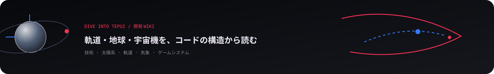

# Dive into Tepui WIKI

この WIKI は、コードベースを5つの分野にまとめて説明する。**技術**はソフトウェアの構造と実行基盤、**太陽系**は天体・暦・重力環境、**軌道**は宇宙機の運動と航法、**気象**は地球大気・雲・気象場、**ゲームシステム**はプレイ進行・船体・戦闘・保存を扱う。詳細な実装一覧ではなく、各分野の「何が重要で、どこでつながるか」を短い段落と図で追えるようにしている。

| 分野 | 主題 | 主な入口 |
| --- | --- | --- |
| [技術](01-technology.md) | 状態所有、WebGPU、ストリーミング、永続化、検証 | `src/run/`, `src/render/`, `tools/` |
| [太陽系](02-solar-system.md) | 天体系、天体暦、重力・自転、基準座標、天体表示 | `src/game/celestial/`, `src/physics/ephemeris/` |
| [軌道](03-orbits.md) | 状態伝播、摂動、マニューバー、CR3BP、軌道UI | `src/physics/`, `src/game/plan/` |
| [気象](04-weather.md) | 大気、気候データ、循環、雲生成、光学 | `src/render/cloud/`, `src/render/atmosphere.ts` |
| [ゲームシステム](05-game-systems.md) | プレイループ、船体、戦闘、ラン管理、入力 | `src/game/`, `src/launcher/` |

> [!IMPORTANT]
> コードの現在はコード自身が原本である。ゲームが**どう振る舞うべきか**は [SPEC](../DEVELOP/SPEC/README.md)、層・状態所有・import の規則は [ARCHITECTURE](../DEVELOP/ARCHITECTURE.md)、コードの書き方は [CODING-RULE](../DEVELOP/CODING-RULE.md) を参照する。

<a href="../README.md"><strong>← README</strong></a> · <a href="01-technology.md"><strong>技術 →</strong></a>
