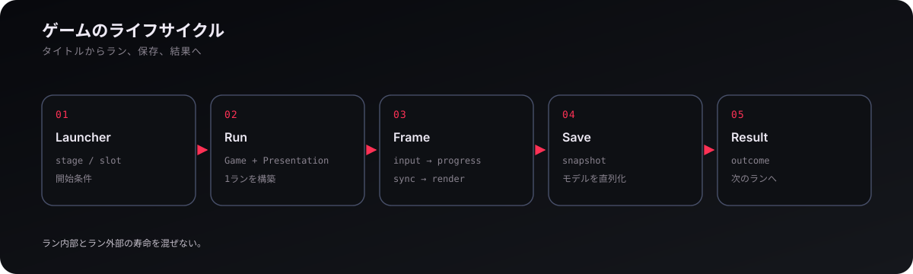
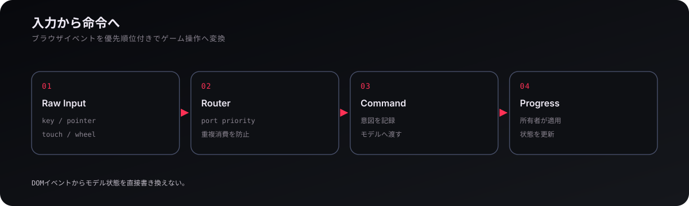

# ゲームシステム

## 1. プレイループ

ゲームの中心は、**目標を捕捉し、軌道を計画し、時間を進め、会合し、相対運動を整えて交戦する**という連続したループである。戦闘ビューとマップビューは別ゲームではなく、同じシミュレーションを近距離操作と長時間航法の二つの時間スケールから見る。時間加速はこの二つをつなぐ。

一回のランでは `Game` が動的エンティティ、ステージ、時間加速、操作対象、計画、Viewer を束ね、`GamePresentation` が入力と表示を接続する。ステージ固有の勝敗や初期配置は `src/game/stages/` に分離される。

## 2. 船体と建造

船は固定モデルではなく、**モジュール実体と接続辺からなる ShipAssembly** である。cockpit、tank、thruster、RCS、weapon、dock、radiator、solar panel、booster などが独立した状態を持ち、接続構造から総質量、重心、慣性、能力を導出する。燃料消費や分離で構造が変われば、物理特性も再計算される。

ドッキングは二つの船を親子追従させる特殊処理ではなく、接続後に一つの assembly へ統合する。分離は接続グラフを切り、連結成分を新しい船体として再構成する。主な入口は `src/game/ship/`、質量特性は `src/physics/ship-mass-properties.ts` にある。

## 3. 会合と戦闘

戦闘では、**距離より相対運動が本質的な量になる**。敵の現在位置ではなく、弾の飛行時間後に交差する見越し点を計算し、実体弾は発射時の自機速度を引き継いで飛ぶ。したがって軌道、姿勢、弾速、相対速度、時間加速が一つの射撃問題に入る。

被弾は接触→損傷→状態変更→出来事という順で処理し、閃光や効果音はその出来事を表示側が翻訳する。破片や薬莢が多数出る場合も、物理状態と instanced rendering を分けることで、表示最適化がゲーム結果を変えないようにする。

## 4. ラン・保存・設定

Launcher は、**タイトル画面からステージとセーブを選び、Run を作り、結果後に次のランへ遷移させる**。Game が一回のプレイ内部を担当するのに対し、Launcher はランの外側の寿命を持つ。セーブはモデル状態を snapshot として直列化し、復元時には GPU や DOM を保存せず新しく作り直す。

設定はさらに別寿命で、テーマや描画品質、BGM 音量のようにセーブを跨いで共通する値を `src/settings/` が所有する。カメラや航法ターゲットのようにセーブごとに違う選択は Viewer 側に置く。ラン管理の入口は `src/launcher/`、保存は `src/launcher/save/` である。

## 5. 入力と UI

入力は、**ブラウザイベントを生データとして集め、優先順位付きでゲーム操作へ変換し、命令としてモデルへ渡す**。Input はキー・ポインタ・タッチを扱うが、「T はターゲット切替」といったゲーム意味は持たない。GameInputRouter が機能別 port へ入力を配り、モーダル・ポーズ・建造中などの優先順位を一箇所で制御する。

UI も同じ境界に従う。共通ウィンドウや overlay は `src/hud/`、軌道・船・敵・計画などゲーム固有パネルは `src/game/hud/` に置かれる。DOM のクリックからモデルを直接代入せず、command queue を通すことでフレーム位相と状態所有を保つ。

<a href="weather.md"><strong>← 気象</strong></a> · <a href="README.md"><strong>WIKI</strong></a> · <a href="../README.md"><strong>プロジェクト README →</strong></a>
