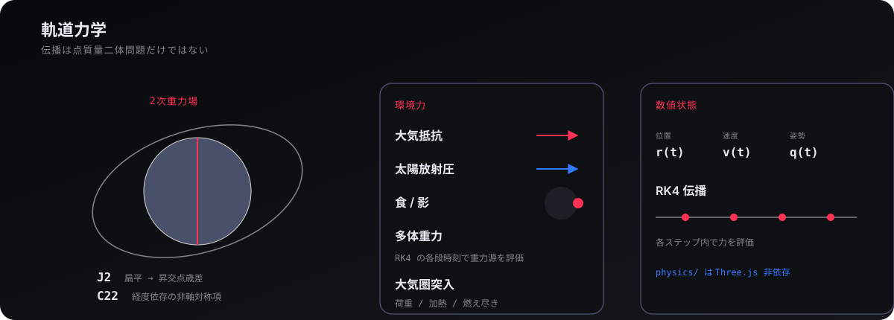
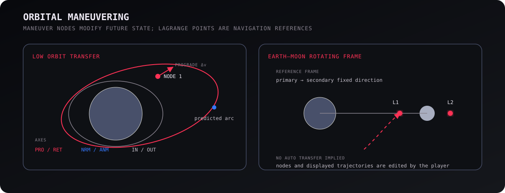
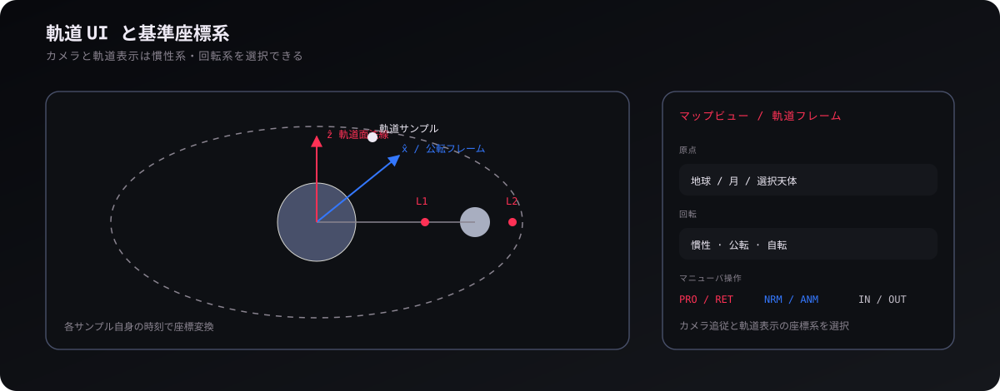

# 軌道

## 1. 状態と伝播

軌道計算の正本は、**時刻 (t)、位置 (mathbf r)、速度 (mathbf v) の状態**である。軌道要素やプログレード方向はこの状態から導出し、未来状態は重力や環境力を評価して RK4 などで伝播する。予測軌道は便利なキャッシュだが、実際の進行結果そのものではない。

`src/physics/dynamics.ts` と `dynamic-trajectory.ts` が伝播を追う入口になる。各 RK4 段では、その段の時刻における天体位置や外力を評価するため、高時間加速でも「ステップ開始時の天体位置を固定する」といった簡略化を避けられる。

## 2. 摂動と環境力

ゲーム内の軌道は、**Kepler 二体問題へ J2/C22、多体重力、大気抵抗、太陽放射圧、遮蔽を加えた運動**として扱う。J2 は扁平による長期的な軌道面変化、C22 は経度方向の非軸対称重力を表す。低軌道では大気の自転に対する相対速度が抗力へ効き、長時間では小さな SRP も蓄積する。

これらは「リアルらしく見せる補正」ではなく、同じ状態方程式に入る物理項である。大気は `atmosphere.ts`、太陽放射圧は `srp.ts`、食・遮蔽は `shadow.ts` / `occlusion.ts` が入口になる。

## 3. マニューバーと予測

マニューバーノードは、**未来のある時刻で Δv を加え、その後の軌道を再計算する計画要素**である。PRO/RET、NRM/ANM、IN/OUT の3軸で変更し、上流ノードを編集すれば、その結果に依存する下流予測も変わる。したがってノード列は独立した点ではなく、順序を持つ計画である。

モデル側の計画は `src/game/plan/plan.ts` と規則群、表示側は `plan-path.ts`、`plan-display.ts`、`node-gizmo.ts` などに分かれる。画面上の線やハンドルが消えても、計画そのものはモデルに残る。

## 4. 三体問題とラグランジュ点

地球–月のような二天体系では、**公転回転系で CR3BP を考えると L1〜L5 やゼロ速度境界が航法上の構造として見える**。L点は「そこへ自動で飛ばす地点」ではなく、二天体系で重力と回転の釣り合いを表す基準である。Halo 軌道や NRHO は L1/L2 近傍の周期・準周期的な運動として別に考える。

実装の入口は `src/physics/cr3bp.ts`、`lagrange.ts`、`zero-velocity.ts`、`halo.ts` にある。マップでは回転系の結果をその時刻の ECI 状態へ変換して表示する。

## 5. 軌道 UI と基準フレーム

軌道 UI は、**同じ軌道を慣性系・公転回転系・自転系など別の見方へ切り替える計器**である。表示原点と回転は別に選べ、軌道線の各点はそのサンプル自身の未来時刻で座標変換する。現在時刻の回転を全点へ一括適用すると、回転系で未来軌道が誤って見えるためである。

Viewer はセーブごとの表示選択を所有し、FrameControls や MapFrame が画面へ反映する。軌道要素の中心天体、カメラのフレーム、予測パネルのフレームは似ているが別の選択なので、同じ enum へ潰さない。

<a href="solar-system.md"><strong>← 太陽系</strong></a> · <a href="README.md"><strong>WIKI</strong></a> · <a href="weather.md"><strong>気象 →</strong></a>
