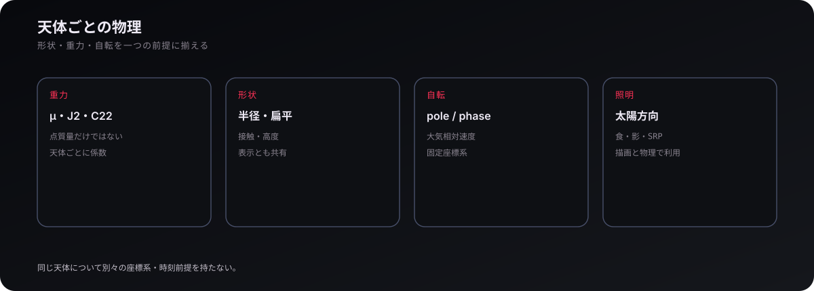
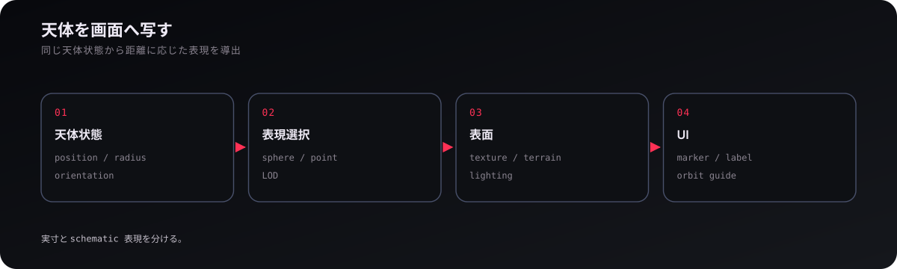

# 太陽系

## 1. 天体系のモデル

太陽系は、**天体の定義・時刻による運動・画面上の表現を分けて扱う**。太陽、惑星、衛星、小天体は親子関係と物理パラメータを持ち、`CelestialSystem` が一つの天体系として束ねる。個々の天体を巨大な「惑星クラス」にまとめず、重力・自転・暦・表示を必要な層で組み合わせる構造である。

コードを読むときは `src/game/celestial/celestial-system.ts` から入り、`solar-system/` の構築へ降りると分かりやすい。ゲーム固有の天体選択や表示は game 側、時刻から状態を計算する純粋な部分は physics 側に置かれる。

## 2. 天体暦と時刻

天体の位置は、**元期と時刻が決まれば同じ暦データから同じ状態を得る**ようにする。ラン開始時に TDB の元期を確定し、ephemeris pack をその時刻へ評価して太陽・惑星・月などの位置と速度を得る。この状態は重力、照明、影、マップ、ラグランジュ点計算の共通入力になる。

セーブでは単なる `simTime` だけでなく、どの元期から数えた経過時間なのかを保持する。元期を変えて同じ `simTime` を復元すれば、月や太陽の絶対配置がずれるためである。実装の入口は `src/physics/ephemeris/` と `ephemeris-context.ts` にある。

## 3. 重力・形状・自転

天体は点質量だけではなく、**重力場、形状、自転を一つの物理前提として扱う**。標準重力パラメータ (mu) に加え、必要な天体では J2 や C22 を持ち、半径や扁平は高度・接触・描画にも使われる。自転軸と位相は body-fixed 座標、C22、大気の相対速度、地表表示へ共通して影響する。

このため、重力だけ別の座標・時刻前提で評価する設計は避ける。同じ天体状態を物理・照明・表示が読み、それぞれの用途へ変換する。天体の物理定義と姿勢は `src/physics/celestial-*.ts`、ゲーム側の具体的な太陽系構築は `src/game/celestial/solar-system/` が主な入口である。

## 4. 基準座標系

太陽系では、**物理状態の基準を慣性系に保ち、必要な表示や解析だけを別座標へ変換する**。ECI / ICRF はシミュレーションの基準、天体中心系は軌道要素、自転系は経度・地表・C22、公転回転系は二天体系や L 点の理解に向く。どの系も別々の「世界状態」ではなく、同じ状態を見る変換である。

この区別は軌道 UI とも直結する。たとえば地球–月回転系では L1/L2 を画面上でほぼ固定して見られるが、実際の ECI 状態は時間とともに回る。座標変換の基礎は `src/physics/frame.ts` と `eci-transform.ts`、天体系の参照フレームは `src/game/celestial/reference-frames.ts` にある。

## 5. 天体をどう見せるか

天体表示は、**実寸の物理状態と、距離に応じて認識可能にする表示を分ける**。近距離では球面・地形・表面材質を描き、遠距離では点や marker、軌道ガイドへ切り替える。schematic な見せ方は画面上の視認性を変えるだけで、重力半径や衝突半径を変えない。

天体の表示は `src/game/celestial/celestial-entity/` と `src/render/celestial/`、軌道ガイドは `src/game/celestial/orbit-guide/` が入口になる。表示形式が変わっても、天体の位置・姿勢・半径という基礎状態は共通である。

<a href="technology.md"><strong>← 技術</strong></a> · <a href="README.md"><strong>WIKI</strong></a> · <a href="orbits.md"><strong>軌道 →</strong></a>
