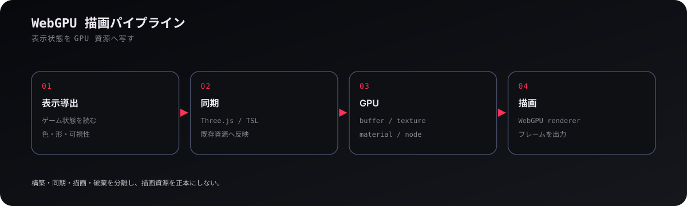
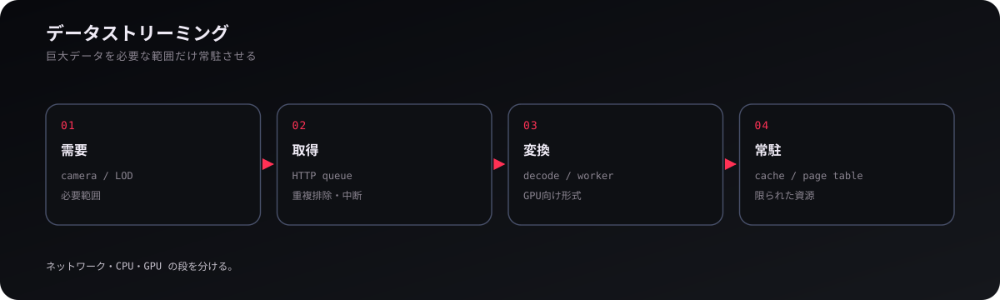
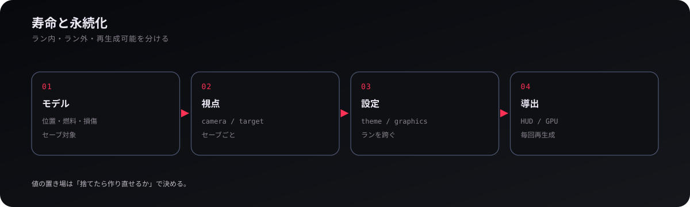
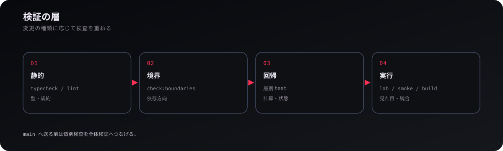

# 技術

## 1. 状態とフレーム

Dive into Tepui の構造は、**正本の状態と、そこから再生成できる表示を分ける**ことから始まる。位置・速度・燃料・損傷のように捨てると復元できない値はモデル側が所有し、HUD、軌道線、GPU メッシュのように作り直せる値は導出側へ置く。この分離により、表示を切り替えても世界の進行結果が変わらない。

1フレームは概ね **入力の解釈 → モデル進行 → 表示状態の導出 → 描画** の順で進む。ブラウザイベントや DOM からモデルを直接書き換えず、命令として進行位相へ渡すのは、この順序を一定に保つためである。全体の入口は `src/run/run.ts`、モデルの根は `src/game/game.ts`、表示導出の根は `src/game/game-presentation.ts` にある。

## 2. WebGPU と描画

描画層は、ゲーム上の意味を判断する場所ではなく、**決められた表示状態を Three.js / WebGPU の資源へ写す場所**である。構築時に geometry・material・texture・buffer を作り、毎フレームの同期では既存資源へ位置・姿勢・色・可視性を反映し、最後に renderer が描画する。GPU 資源を毎フレーム作り直さないこと、描画キャッシュをゲームの正本として読まないことが基本になる。

複雑な地球、大気、雲、線描画では TSL と WebGPU を使う。物理座標と画面表示のスケールが大きく異なるため、実寸モデルだけでなく LOD、schematic 表現、marker、instancing を組み合わせる。主な入口は `src/render/scene.ts` と `src/render/` 以下の各サブシステムである。

## 3. 大規模データのストリーミング

地球表面のような巨大データは、**必要な範囲だけを取得し、限られた CPU/GPU 資源へ常駐させる**。表示需要からタイルを決め、HTTP 要求を重複排除し、worker などで変換し、resident cache と page table を経て GPU 材質から参照する。カメラが移動して需要が変われば、古い要求は中断し、不要な常駐データは入れ替える。

この方式の重要点は、ネットワーク・デコード・GPU 常駐を一つの待ち行列に潰さないことにある。各段のボトルネックが異なるため、取得、変換、待機、常駐を独立して管理する。地球表面実装はこの設計の代表例で、`earth-surface-tile-queue.ts`、`earth-surface-resident.ts`、`earth-surface-page-table.ts` が流れを追う入口になる。

## 4. 寿命・保存・設定

値の置き場は、**どの寿命に属し、捨てたら作り直せるか**で決める。ラン中の物理状態は Game、セーブごとのカメラや表示基準は Viewer、ランを跨いで共通する描画品質やテーマは Settings、GPU や DOM は再生成可能な導出である。この区別がセーブ形式を小さく保ち、復元時に古い表示資源を持ち込まない。

セーブはモデル状態を直列化し、ロード時にはそこから表示資源を再構築する。永続化の入口は `src/launcher/save/`、設定は `src/settings/` にある。保存キーや serialized format は既存ユーザーとの互換性を持つため、単なる内部名より重い契約として扱う。

## 5. 開発と検証

変更は、**型・境界・回帰・実行時表示の4段で検証する**。TypeScript の型検査と lint は局所的な不整合を、`check:boundaries` は依存方向を、層別テストは計算や状態遷移を、Render Lab・Cloud Lab・browser smoke・build は統合時の問題を検出する。描画のように数値テストだけでは判断できない分野では、固定条件の画像比較が必要になる。

開発規約の正本は [AGENTS](../AGENTS.md)、[ARCHITECTURE](../DEVELOP/ARCHITECTURE.md)、[CODING-RULE](../DEVELOP/CODING-RULE.md) である。通常の変更は作業ブランチから PR へ送り、`release` は CI が生成する。生成アセットは正本と generator を確認し、生成結果だけを直接修正しない。

<a href="README.md"><strong>← WIKI</strong></a> · <a href="solar-system.md"><strong>太陽系 →</strong></a>
