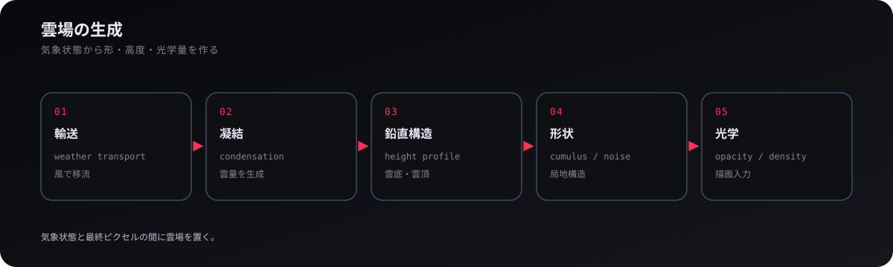
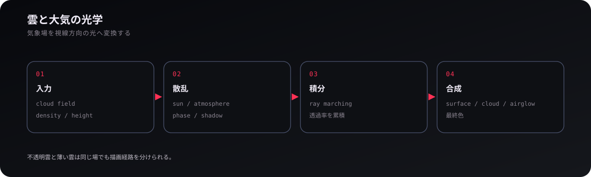

# 気象

## 1. 地球大気を独立した層として扱う

地球は一枚のテクスチャではなく、**地表、大気、雲、大気光、オーロラ、照明を別の層として持つ**。この分離により、地表の高解像度タイル、気象によって変化する雲、視線角に依存する大気散乱を、それぞれ異なる時間・空間スケールで更新できる。気象を変えるために地表画像を焼き直す必要もない。

大気そのものは `src/render/atmosphere.ts`、雲は `src/render/cloud/`、大気光とオーロラは `airglow.ts` と `aurora-field.ts` が入口になる。地表ストリーミングは技術分野の仕組みであり、ここではその上へ時間変化する大気を重ねる。

## 2. 気候・観測データは境界条件

ERA5 などの気候・再解析データは、**雲画像を直接貼るためではなく、風・温度・大域分布の境界条件として使う**。外部データをゲーム内の球面座標・尺度へ正規化し、weather model が時間変化を作るための低周波な基盤へする。これにより、観測データの現実性と、ゲーム内で連続して進む気象を両立できる。

関連する入力処理は `climate-map.ts` と外部変換ツールに分かれる。データの解像度を雲の最終解像度だと考えず、細かな構造は生成側へ任せるのが要点である。

## 3. 大域循環と局地対流

全球の雲運動は、**大域風・Rossby 波・低気圧の組織化と、局地対流を異なるスケールで重ねて作る**。偏西風や波動は数千 km 規模の雲帯を運び、cyclone track は渦状の組織化を与え、convective activity は数時間以下の短寿命な積雲発達を作る。一つのノイズ場を球面上で流すだけでは、これらの時間スケール差が出ない。

実装は `atmospheric-wind.ts`、`rossby-wave.ts`、`cyclone-tracks.ts`、`convective-activity.ts`、`circulation.ts` に分かれる。大域場は局地形状を直接決めるのではなく、輸送や発達の傾向を与える。

## 4. 雲場の生成

雲は、**輸送される気象状態から凝結・鉛直構造・局地形状を経て、光学的な雲場へ変換する**。weather transport が場を運び、condensation が雲量を生み、雲底・雲頂の鉛直情報と cumulus shape / noise が局地構造を与える。最終的な opacity や density は描画用入力であり、気象状態そのものと同一ではない。

`weather-model.ts`、`weather-transport.ts`、`condensation.ts`、`cloud-shape-evaluator.ts`、`generated-cloud-field.ts` が主要な入口である。観測雲を使う経路は `observed-cloud-field.ts` と分離され、生成場と同じ sampler 契約へ接続できる。

## 5. 雲と大気の光学

描画では、**雲場を太陽光・大気散乱・視線方向積分へ通して最終色へ変える**。厚い雲は不透明面に近い経路、薄い雲や体積的な構造は ray marching による透過率・散乱の累積が適する。すべてを一つのシェーダへ押し込むより、同じ雲場から複数の光学経路へ分ける方が表現と性能を調整しやすい。

`cloud-optics.ts` / `cloud-optics-node.ts` が光学、`ray-march.ts` と blue noise が体積積分、`cloud-presentation.ts` が生成場と描画入力の接続を担う。雲の見た目を調整するときは Cloud Lab で気象場・形状・光学のどの段が原因かを分けて確認する。

<a href="orbits.md"><strong>← 軌道</strong></a> · <a href="README.md"><strong>WIKI</strong></a> · <a href="game-system.md"><strong>ゲームシステム →</strong></a>
